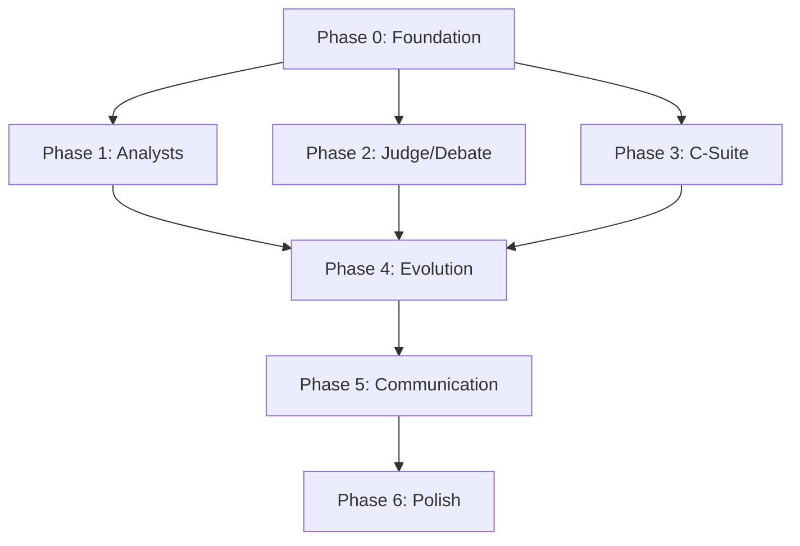

# 🚀 Prioritized Remediation Roadmap

> Transform SelfEvolve from a system with strong infrastructure but stub agents into a fully production-ready, self-evolving autonomous trading system.

---

## Prioritization Matrix

```
                    IMPACT ──────────────────────────►
                    Low           Medium         High
                ┌─────────────┬──────────────┬──────────────┐
    Easy (S)    │             │ A-3 (Macro   │ Dual         │
                │             │  Pydantic)   │ SkillReg     │
    ───────     ├─────────────┼──────────────┼──────────────┤
    Medium (M)  │ Event Bus   │ PM role fix  │ Tool-calling │
                │ subscriptions│ Judge + exec │ bridge       │
    ───────     ├─────────────┼──────────────┼──────────────┤
    Hard (L)    │ Cross-agent │ Extend evol  │ Real skills  │
                │  learning   │ to all agents│ for analysts │
    EFFORT      │             │              │ C-Suite      │
        │       │             │              │ rebuilds     │
        ▼       └─────────────┴──────────────┴──────────────┘
```

---

## Phase 0: Foundation Fixes (Week 1)
> Fix systemic issues that block everything else

### 0.1 Consolidate Dual SkillRegistry ⏱️ 2 hours
**Files**: `skills/registry.py`, `skills/validator.py`
- Merge into single `SkillRegistry` in `validator.py`
- Fix `@skill` decorator to require `agent_name`
- Update all skill files to use correct decorator
- Delete `registry.py`

### 0.2 Build Tool-Calling Bridge ⏱️ 8 hours
**Files**: `agents/base_agent.py`
- Add `_load_skills()` method to BaseAgent
- Convert registered skills to LangChain `@tool` definitions
- Use `llm.bind_tools()` for agents with skills
- Implement tool-calling loop in `BaseAgent.invoke()`
- This unlocks EVERY agent to use their skills

### 0.3 Fix Wrong AgentRoles ⏱️ 1 hour
- `PortfolioManager`: `AUDITOR` → new `PORTFOLIO_MANAGER` role
- `StrategyResearcher`: `META_REVIEW` → new `STRATEGY_RESEARCHER` role
- Add new roles to `AgentRole` enum

---

## Phase 1: Analyst Agent Production Readiness (Week 2)
> Make the core trading agents functional with real data

### 1.1 Technical Analyst — Real Skills ⏱️ 6 hours
Replace stubs with real implementations using `pandas_ta`:
- `compute_rsi(ticker, period)` → Real RSI calculation
- `compute_macd(ticker)` → Real MACD
- `compute_bollinger_bands(ticker)` → Real BB
- `get_price_data(ticker, period)` → Alpaca bars API
- Wire all through `@skill("Technical Analyst")`

### 1.2 Fundamental Analyst — Real Skills ⏱️ 6 hours
- `fetch_financial_data(ticker)` → Financial data API
- `compute_intrinsic_value(ticker)` → DCF model
- `fetch_earnings(ticker)` → Earnings data
- Wire through `@skill("Fundamental Analyst")`

### 1.3 Sentiment Analyst — Real Skills ⏱️ 6 hours
- `fetch_news(ticker)` → Alpaca News API (already in alpaca_client.py)
- `analyze_sentiment(text)` → NLP sentiment
- Wire through `@skill("Sentiment Analyst")`

### 1.4 Macro Analyst — Real Skills + Pydantic ⏱️ 4 hours
- `fetch_economic_data(indicator)` → FRED API or equivalent
- `get_market_breadth()` → Market data
- Add `MacroConvictionScore` Pydantic output schema

---

## Phase 2: Judge & Debate Agent Upgrades (Week 3)

### 2.1 Wire Judge to Execution Layer ⏱️ 4 hours
- Connect `position_sizing.py` as a Judge tool
- Connect `circuit_breaker.py` as a Judge tool
- Connect `settlement_tracker.py` as a Judge tool
- Judge calls these BEFORE making decisions

### 2.2 Add Bull/Bear to SCORABLE_ROLES ⏱️ 3 hours
- Add `BULL` and `BEAR` to `SCORABLE_ROLES`
- Create `DebateArgument` Pydantic output schema
- Track debate scores as predictions in `prediction_tracker`
- Enable Brier score computation for debate agents

### 2.3 Add Bull/Bear Skills ⏱️ 4 hours
- Replace stubs with real analysis tools
- Connect to market data for pattern identification
- Wire through `@skill("Bull Agent")` / `@skill("Bear Agent")`

---

## Phase 3: C-Suite Agent Rebuild (Weeks 4-5)
> Priority order: QA → Auditor → Journaling → CTO → Developer → CSO → Product

### 3.1 QA Agent Rebuild ⏱️ 8 hours
**Why first**: QA validates all other agents, critical for production safety
- Real tools: `validate_output_schema()`, `run_regression_tests()`, `check_guardrails()`
- Connect to `evolution/bug_scanner.py` for proactive bug detection
- Subscribe to `AGENT_EVENTS` to validate outputs automatically
- Add to SCORABLE_ROLES for evolution

### 3.2 Auditor Agent Rebuild ⏱️ 6 hours
**Why second**: Regulatory compliance is mandatory for live trading
- Real tools: `check_settlement_status()`, `count_gfv_strikes()`, `cross_reference_ledger()`
- Connect to `execution/settlement_tracker.py`
- Subscribe to `TRADE_EVENTS` for real-time audit
- Add compliance gate before execution

### 3.3 Journaling Agent Rebuild ⏱️ 4 hours
**Why third**: Audit trail needed for regulatory compliance
- Subscribe to `TRADE_EVENTS` on Event Bus
- Auto-generate trade journal entries from trade + debate data
- Real tools: `fetch_trade_details()`, `write_journal_entry()`
- Persist to database

### 3.4 CTO Agent Rebuild ⏱️ 6 hours
- Real tools: `get_system_metrics()`, `check_db_health()`, `analyze_error_rates()`
- Connect to Prometheus/metrics endpoint
- Subscribe to `HEALTH_EVENTS`
- Alert Jarvis on system issues

### 3.5 Developer Agent — Merge or Remove ⏱️ 4 hours
- **Decision needed**: Merge with `evolution/engineer_agent.py` or remove?
- The evolution module already has `EngineerAgent`, `BugWorker`, `BugScanner`
- If keeping: wire to real tools for code reading, test running
- If removing: consolidate into evolution module

### 3.6 CSO Agent Rebuild ⏱️ 4 hours
- Real tools: `scan_env_files()`, `detect_prompt_injection()`, `verify_api_keys()`
- Periodic security scanning
- Alert on security events

### 3.7 Product Agent Rebuild ⏱️ 3 hours
- Connect to Jarvis's `AgentPlanner` for roadmap alignment
- Track owner directives from Telegram messages
- Real tools: `get_feature_backlog()`, `measure_feature_roi()`

---

## Phase 4: Evolution Expansion (Week 6)

### 4.1 Extend SCORABLE_ROLES ⏱️ 4 hours
Add ALL agents that make decisions:
- `MASTER`, `BULL`, `BEAR`, `PORTFOLIO_MANAGER`, `AUDITOR`, `QA`, `STRATEGY_RESEARCHER`
- Define what "prediction" means for each (not all have ticker-level predictions)

### 4.2 Connect Vector Store for Rule RAG ⏱️ 6 hours
- Wire `memory/vector_store.py` (Qdrant) to `EvolutionRunner`
- Store rules as vectors instead of concatenated text
- Retrieve top-3 relevant rules during agent initialization
- Implement the "Rule Consolidator" from the architecture spec

### 4.3 Add Cross-Agent Learning ⏱️ 8 hours
- When one agent learns a rule, evaluate if related agents should learn too
- Example: Technical Analyst learns "RSI divergence unreliable in trending markets" → Inform Bull/Bear

---

## Phase 5: Communication & Integration (Week 7)

### 5.1 Inter-Agent Messaging ⏱️ 6 hours
- Add `send_message()` / `receive_message()` to `BaseAgent`
- Use `AGENT_EVENTS` channel on Event Bus
- Enable: Auditor → Judge compliance gates, QA → All validation, CTO → Jarvis alerts

### 5.2 Event Bus Subscriptions ⏱️ 4 hours
- Journaling Agent subscribes to `TRADE_EVENTS`
- CTO subscribes to `HEALTH_EVENTS`
- QA subscribes to `AGENT_EVENTS`
- All agents publish relevant events

### 5.3 Model Orchestrator Integration ⏱️ 4 hours
- Persist ModelOrchestrator metrics to PostgreSQL
- Wire into `BaseAgent.__init__()` for dynamic model selection
- Add Event Bus publishing for model switches

---

## Phase 6: Polish & Verification (Week 8)

### 6.1 End-to-End Integration Tests ⏱️ 8 hours
- Test complete trading flow: market data → analysts → debate → judge → execution
- Test evolution flow: trade → Brier → post-mortem → mutation → shadow → promotion
- Test C-Suite flow: trade → audit → journal → QA validation

### 6.2 Dashboard Integration ⏱️ 4 hours
- Brier score trends
- Trust weight trajectories
- Agent communication graph
- Skill usage metrics

### 6.3 Documentation Update ⏱️ 2 hours
- Update architecture docs to reflect actual implementation
- Document all real tools per agent
- Create operator runbook

---

## Total Estimated Effort

| Phase | Description | Effort |
|-------|-------------|--------|
| Phase 0 | Foundation Fixes | ~11 hours |
| Phase 1 | Analyst Production Readiness | ~22 hours |
| Phase 2 | Judge & Debate Upgrades | ~11 hours |
| Phase 3 | C-Suite Rebuilds | ~35 hours |
| Phase 4 | Evolution Expansion | ~18 hours |
| Phase 5 | Communication & Integration | ~14 hours |
| Phase 6 | Polish & Verification | ~14 hours |
| **TOTAL** | | **~125 hours** |

---

## Key Dependencies



> [!IMPORTANT]
> Phase 0 (Foundation) MUST be completed first. The tool-calling bridge (0.2) is the single most impactful change — it unlocks every agent to use their skills.
