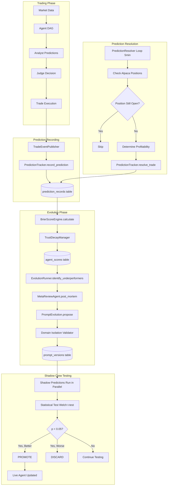

# 01 — Evolution Architecture Overview

## System Vision

SelfEvolve is an autonomous multi-agent trading system that **improves itself** by:
1. Recording agent predictions at trade time
2. Resolving outcomes when trades close
3. Computing calibration scores (Brier) for each agent
4. Adjusting trust weights based on performance
5. Evolving prompts through statistically-validated A/B testing

## End-to-End Data Flow

## Component Map

| Component | File | Role |
|-----------|------|------|
| **TradeEventPublisher** | `core/trade_event_publisher.py` | Records predictions at trade submission |
| **PredictionTracker** | `evolution/prediction_tracker.py` | CRUD for prediction records |
| **PredictionResolver** | `evolution/prediction_resolver.py` | Background loop resolving outcomes |
| **BrierScoreEngine** | `evolution/reflexion.py` | Computes Brier scores |
| **TrustDecayManager** | `evolution/reflexion.py` | Exponential trust decay/boost |
| **TrustUpdater** | `evolution/trust_updater.py` | Orchestrates trust weight updates |
| **EvolutionRunner** | `evolution/evolution_runner.py` | Full evolution cycle orchestrator |
| **MetaReviewAgent** | `agents/meta_review_agent.py` | LLM-based post-mortem analysis |
| **PromptEvolution** | `evolution/reflexion.py` | Statistical significance testing |
| **OperationalScorer** | `evolution/operational_scorer.py` | Metrics for non-prediction agents |
| **StrategyEvolution** | `agents/strategies/strategy_evolution.py` | Strategy-level evolution engine |
| **StrategySignalAggregator** | `orchestration/strategy_signal_aggregator.py` | Trust-weighted signal blending |

## Schedule

| Time (UTC) | Phase | Evolution Activity |
|------------|-------|-------------------|
| 03:00 | Overnight | Continuous evolution cycle (backtest + trust) |
| 11:00 | Pre-Market | Continuous evolution cycle |
| 17:00 | Midday | Continuous evolution cycle |
| 20:30 | Post-Market | **Full** evolution (trust + post-mortem + prompt mutation + shadow eval) |
| 21:00 | Post-Close | Continuous evolution cycle |
| Every 5min | Background | PredictionResolver checks for closed trades |

## Safety Invariants

1. **Identity Core is NEVER modified** — only `Strategic_Nuance` sections evolve
2. **Domain isolation** — Pydantic validators prevent cross-domain prompt leakage
3. **Statistical gates** — Prompt promotion requires p < 0.05 (Welch's t-test)
4. **Minimum sample size** — Shadow tests need ≥20 trades before evaluation
5. **Trust floor** — Agent trust never drops below 0.1 (MIN_TRUST_WEIGHT)
6. **Human override** — HITL gateway can block any trade execution
