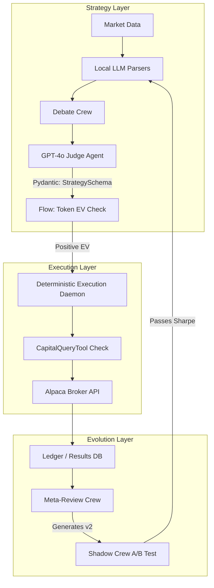

# Executive Summary Implementation Plan

## 1. Architectural Paradigm: Decoupling Intelligence from Execution
To circumvent the "Latency Trap" and "Slippage Cost" inherent in using LLMs as direct reasoning engines, the architecture explicitly separates qualitative reasoning from quantitative execution. 

### Implementation Details:
*   **Strategy Layer (CrewAI + LLMs)**: Generates high-level directives ("Daily Parameters", e.g., max sector exposure, directional bias, confidence level).
*   **Execution Layer (Python/Rust Daemon)**: A low-latency, deterministic execution system that operates on standard algorithmic triggers (like RSI or VWAP). It executes trades *only if* the triggers align with the LLM's active Daily Parameters.
*   **CrewAI Flows**: Instead of relying on agent autonomy for tool usage, the LLM nodes are wrapped in CrewAI Flows that enforce a strict programmatic pipeline. The LLM produces a `StrategySchema` (Pydantic), which is piped directly into a `DeterministicExecutionNode`.

## 2. Micro-Capital Constraint Enforcements ($100 Sandbox)
Managing a $100 portfolio mandates strict zero-commission execution and hyper-efficient fractional share management to prevent token bleed and slippage from destroying capital.

### Implementation Details:
*   **CostTrackingFlow**: Wraps the CrewAI Task. Before an LLM begins complex reasoning, a `NetExpectedValueNode` calculates the estimated profit against the projected API token cost. Negative EV trades are instantly aborted.
*   **Model Tiering**: Employs lightweight, local models (e.g., Llama 3 8B via Groq) for 90% of data parsing and context building. Premium models (e.g., GPT-4o) are reserved strictly for the final `Judge Agent` decision to preserve operational capital.
*   **Deterministic Capital Tools**: Agents cannot guess capital. They must query a custom `CapitalQueryTool` that returns strict JSON. The `Judge Agent` mathematically rejects tasks exceeding available funds.

## 3. Self-Evolution Framework
The system autonomously adapts to market regimes without human code intervention, updating its own prompts and logic based on empirical performance.

### Implementation Details:
*   **Immutable Core vs. Mutable Strategy**: The database strictly divides agent prompts. `Core_Directives` (risk limits, mandate) are immutable. `Current_Hypothesis` is mutable and can be rewritten by the Meta-Review Crew.
*   **A/B Testing & Shadow Crews**: To prevent "Catastrophic Forgetting", newly evolved prompts (v2) are deployed to a *Shadow Crew* that paper-trades alongside the production Crew (v1). v2 is promoted to production only if it achieves a statistically significant Sharpe ratio improvement over a rolling 7-day window.

## 4. Mermaid Diagram: High-Level Architecture

