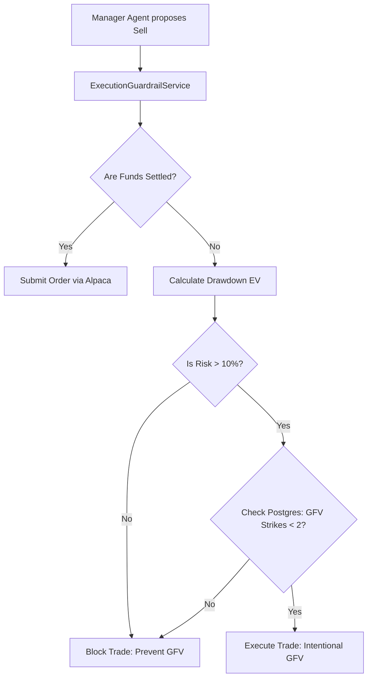

# Regulatory Landscape Implementation Plan

## 1. PDT Rule Avoidance via Cash Account Enforcement
Pattern Day Trader (PDT) rules are bypassed by strictly operating within a Cash Account environment. The architectural challenge shifts from PDT compliance to strict Good Faith Violation (GFV) management.

### Implementation Details:
*   **Initialization Gatekeeper**: On system boot, an initialization script queries Alpaca API to verify the account type is `CASH`. If `MARGIN` is detected, the Orchestrator throws a fatal error and refuses to start, halting operations.
*   **BrokerHealthCheckNode**: Included at the start of daily CrewAI flows to poll `account.status` and `account.daytrade_count`. If a restriction is detected (e.g., `ACCOUNT_RESTRICTED`), the system triggers a hibernation state and alerts the operator.

## 2. GFV Guardrails & Dynamic Risk Routing
Blocking all sell-orders on unsettled funds prevents GFVs, but it mathematically exposes the $100 portfolio to catastrophic unmitigated drawdowns. Regulatory compliance must be weighed against portfolio survival.

### Implementation Details:
*   **ExecutionGuardrailService**: A deterministic abstraction layer sits between the `Manager Agent` and Alpaca API. The LLM is stripped of GFV context to reduce hallucination and save tokens.
*   **Dynamic EV Routing**: When a stop-loss is proposed on unsettled funds, the Guardrail Service calculates the EV. If blocking the trade risks a catastrophic loss (>10% portfolio equity), the system is explicitly authorized to execute the trade and *intentionally trigger a GFV* strike, preserving capital.
*   **Stateful Strike Tracking**: A PostgreSQL `gfv_strike_count` table limits intentional GFVs to a maximum of 2 per rolling 12-month period to avoid a hard 90-day lock.

## 3. Cash Account Monitoring & Source of Truth
Accurate tracking of "settled" vs. "unsettled" cash is paramount. LLM-calculated state drifts and internal SQLite delays cannot be trusted for final execution authorization.

### Implementation Details:
*   **PreTradeSettlementFlow**: An execution node that queries Alpaca's explicit `settled_cash` API endpoint *immediately* prior to order submission. Internal databases are strictly reserved for planning and context.
*   **Pydantic State Validation**: The LLM output (`ProposedTrade`) is parsed with a strict Pydantic validator (`@validator('trade_amount')`). If `trade_amount > GlobalState.settled_cash`, the flow automatically rejects and re-prompts, bypassing agent hallucination.
*   **Adaptive Polling**: Cash management agents dynamically shift to WebSockets or implement exponential back-offs if HTTP 429 rate limits are detected during API queries.

## 4. Mermaid Diagram: Compliance & GFV Execution Flow

