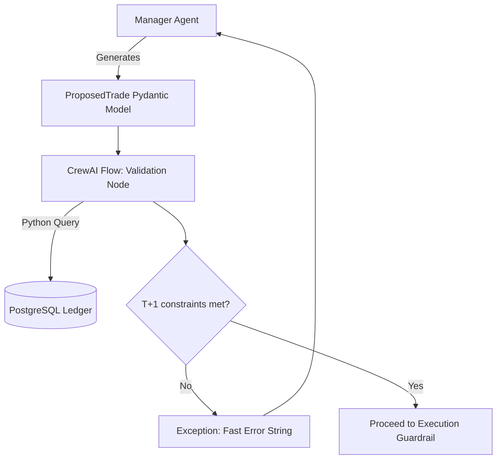

# Settlement Mechanics Implementation Plan

## 1. Deterministic Clearinghouse Validation
Using an LLM agent to simulate clearinghouse mathematics and date-time settlement checks is computationally wasteful and highly prone to hallucination. Settlement constraints are strictly numerical and deterministic.

### Implementation Details:
*   **Validation Node**: The LLM-based `Simulated Clearing House Agent` is replaced by a pure Python `Validation Node` embedded in the CrewAI flow.
*   **Pydantic Enforcement**: The Manager Agent outputs a `ProposedTrade(BaseModel)`. The Validation Node verifies this schema against internal Postgres ledger states. Invalid trades trigger immediate exceptions caught by the flow, routing a cheap, explicit string (e.g., `Error: Insufficient settled funds. Max: $4.20`) back to the Manager. 

## 2. Ledger State Tracking (T+1)
Accurate tracking of trade execution times and settlement clearing dates requires robust time-series management that respects market holidays and weekend offsets.

### Implementation Details:
*   **LedgerTrackerTool**: A custom tool integrating with a PostgreSQL database to log the exact execution timestamp. It uses deterministic Python logic (e.g., `pandas_market_calendars`) to calculate the exact T+1 clearing date, bypassing the LLM.
*   **Self-Correcting Mechanism**: The tool tracks theoretical vs. actual settlement. If the broker modifies settlement logic, the agent observing discrepancies executes a `ToolUpdateAction` to dynamically adjust the internal clearing offset.

## 3. Context Pruning for Cash vs. Margin
The $100 architecture runs exclusively on a Cash Account. Forcing the LLM to process complex Margin simulation logic wastes context tokens, causes reasoning bleed, and introduces the risk of panic-selling due to "simulated" margin calls.

### Implementation Details:
*   **Strict Context Pruning**: The `Margin Simulation Tool` is completely stripped from Phase 1 and 2 prompts. The Risk Manager is given an explicit system directive: "You operate a Cash Account. Margin does not exist. Focus solely on cash drawdown."
*   **Modular Architecture (Phase 3)**: Margin logic is physically isolated in a separate Git branch (`margin_execution_flow.py`). CI/CD pipelines only merge and deploy this module if a global configuration flag (`ACCOUNT_TYPE=MARGIN`) is activated.

## 4. Freeriding Anomaly Detection
Detecting freeriding requires cross-referencing chronological execution orders across the broker's API and the internal state to catch timing misalignments.

### Implementation Details:
*   **FreeridingDetectorTool**: An asynchronous background process run by the `Auditor Agent`. It validates the chronological sequence of buys and sells against the underlying settled fund timestamps.
*   **Simulation Training**: During Phase 2 paper-trading, synthetic freeriding events are purposefully triggered. The `Meta-Review Crew` extracts the data signature of the failure and permanently encodes the detection logic into the Auditor Agent.

## 5. Mermaid Diagram: Deterministic Settlement Flow

