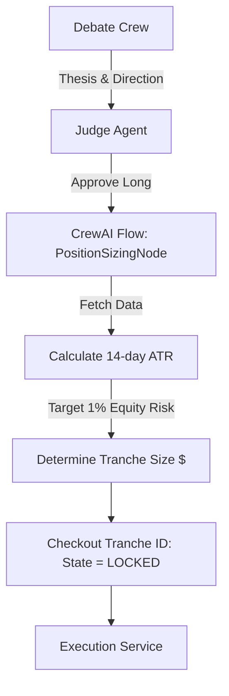

# Capital Tranching Strategy Implementation Plan

## 1. Dynamic Position Sizing & Volatility Targeting
Using an LLM's raw `Confidence_Score` as a direct multiplier for position sizing is dangerous due to LLM hallucination and overconfidence. Position sizing must be rooted in deterministic mathematics.

### Implementation Details:
*   **Decouple Conviction from Size**: The LLM determines the direction (Long/Short) and generates the underlying thesis. It does NOT determine the dollar allocation.
*   **Volatility-Targeted Sizing (Risk Parity)**: A deterministic `PositionSizingNode` intercepts the LLM output. It queries the asset's 14-day Average True Range (ATR). It mathematically sizes the position so that a 1-ATR price move corresponds exactly to a 1% shift in total account equity.

## 2. Drawdown Limit Enforcement & Flash Crash Survival
A $100 account cannot survive large drawdowns. A 10% loss requires an 11% gain to recover. However, executing raw market orders during a flash crash guarantees catastrophic slippage.

### Implementation Details:
*   **Push over Pull (WebSockets)**: Continuous polling for equity risks HTTP 429 errors. A persistent WebSocket connection to Alpaca's `trade_updates` stream maintains a live, reactive mark-to-market state.
*   **Smart LiquidationFlow**: If equity drops below the global `Max_Daily_Drawdown` threshold (e.g., $95.00 intraday), the system initiates a `LiquidationFlow`. It issues **limit orders pegged to the current Bid + defined slippage tolerance**. If unfilled after 10 seconds, it walks the limit down. Raw market orders are strictly prohibited.
*   **Dynamic Threshold Evolution**: If the system is repeatedly stopped out at the absolute bottom before a rally, the Meta-Review Crew autonomously adjusts the `Max_Daily_Drawdown` threshold (e.g., from 5% to 7%) to fit the current market noise floor.

## 3. Fractional Tranche Lifecycle Management
The $100 capital base is compartmentalized into fractional tranches ($5 or $10). State management ensures capital is not accidentally double-spent.

### Implementation Details:
*   **State Machine Integration**: Tranche states (`AVAILABLE` -> `LOCKED_IN_TRADE` -> `SETTLING` -> `AVAILABLE`) are tracked by a deterministic external wrapper, not the LLM.
*   **Checkout Mechanism**: The `Execution Agent` must explicitly "checkout" an `AVAILABLE` tranche ID via a custom tool before routing the order.
*   **Schema Constraints**: The Pydantic `ExecutionSchema` strictly restricts the `side` parameter to `BUY` or `SELL`. Shorting is programmatically disabled at the schema level to prevent the LLM from attempting illegal fractional shorting.

## 4. Mermaid Diagram: Volatility-Targeted Tranching

