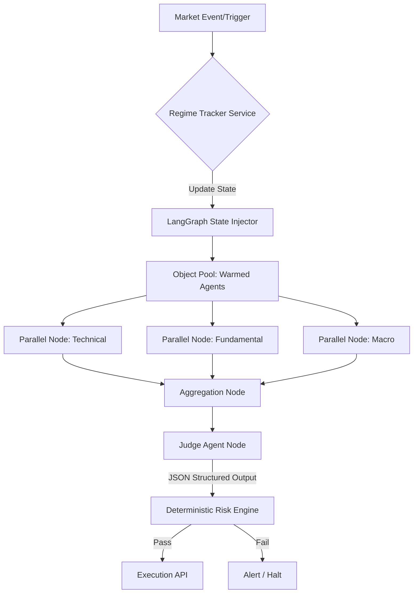

# Orchestration Framework Implementation: LangGraph & Deterministic Flows

## 1. Architectural Refinement: DAGs over Open Delegation
The original concept of a free-flowing, conversation-centric or purely hierarchical LLM routing system (e.g., standard CrewAI open delegation) is deprecated for live execution. To eliminate latency, token bloat, and non-deterministic routing loops, the system implements a strict **Directed Acyclic Graph (DAG)** orchestration model using **LangGraph** (or deterministic CrewAI Flows).

### 1.1 Key Principles
- **Deterministic Routing**: The path of execution is hardcoded in Python. The LLMs act as nodes that perform specific analysis, but they do not decide the routing logic.
- **Object Pooling (Warm Standby)**: To avoid "cold boot" latency (which can take 3-5 seconds and miss market moves), all agents are instantiated and hydrated with memory pre-market (e.g., 08:00 AM) and kept in a sleep state.
- **Native Structured Outputs**: To eliminate API waste from formatting errors, all LLM nodes use OpenAI/Anthropic native Structured Outputs. The LLM is forced by the provider API to generate valid JSON, dropping the validation error rate to near 0%.

## 2. State Management & Injection
State is managed outside the LLM context. The LLM is never relied upon to track the absolute $100 capital balance or perform arithmetic.
- **Pydantic FlowState**: A strongly typed Pydantic object tracks available capital, pending settlements, and market regime.
- **Mathematical Abstraction**: The LLM outputs percentages (e.g., "allocate 0.5 of max allowed risk"). A deterministic Python edge/node translates this into exact dollar amounts (e.g., $5.00) based on the true database state, preventing hallucinations of capital.

## 3. Mermaid Diagram: Orchestration Flow



## 4. Code Structure & Implementation

```python
from typing import TypedDict, Annotated, List
from langgraph.graph import StateGraph, END
from pydantic import BaseModel

# 1. Define the strictly typed state
class PortfolioState(TypedDict):
    regime: str
    available_capital: float
    tech_signal: dict
    fund_signal: dict
    final_decision: dict

# 2. Define deterministic Python nodes (Not LLMs)
def regime_tracker_node(state: PortfolioState):
    # Fetch VIX, calendar, etc. deterministically
    state["regime"] = "HIGH_VOL"
    return state

def technical_agent_node(state: PortfolioState):
    # Call pre-warmed LLM with structured output
    # Returns Pydantic model
    state["tech_signal"] = {"conviction": 0.8, "rationale": "..."}
    return state

# 3. Build the rigid DAG
workflow = StateGraph(PortfolioState)
workflow.add_node("regime_tracker", regime_tracker_node)
workflow.add_node("technical_agent", technical_agent_node)
# Add other nodes...

workflow.set_entry_point("regime_tracker")
workflow.add_edge("regime_tracker", "technical_agent")
# Compile the immutable graph
app = workflow.compile()
```

## 5. Constraint Awareness ($100 Micro-Capital)
By moving routing and state validation to deterministic Python and utilizing strict JSON enforcement, the system drastically reduces token usage. A single execution loop runs purely on the needed analytical tokens, without wasting API credits on "chatting" between agents or retrying broken JSON schemas.
