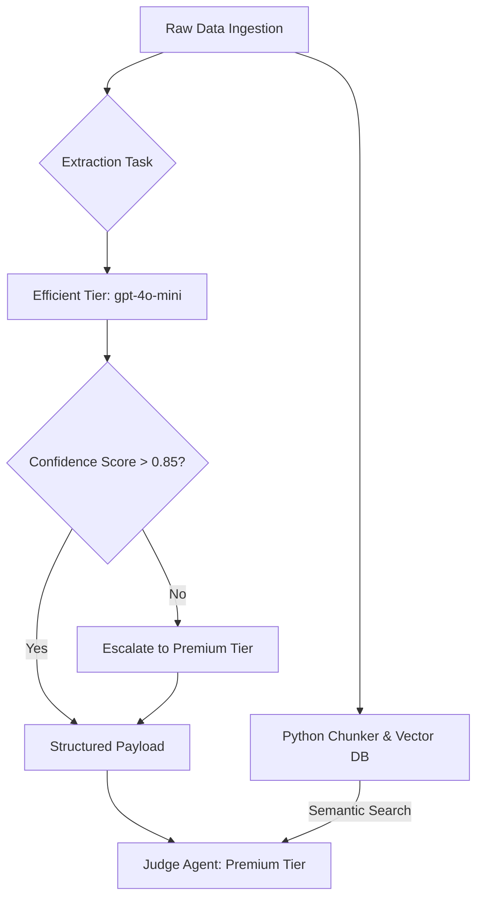

# Model Tiering Strategy Implementation

## 1. Architectural Refinement: Strategic Resource Allocation
Given the micro-capital constraint of $100, executing all tasks via premium models (like GPT-4o or Claude 3.5 Sonnet) will quickly drain the account through API fees. The architecture employs a tiered LLM strategy, mapping specific models to specific tasks based on complexity and risk, while avoiding the "Garbage In, Garbage Out" (GIGO) trap.

### 1.1 Tiered Mapping
- **Efficient Tier (e.g., GPT-4o-mini, Claude 3 Haiku)**: Used strictly for broad market monitoring, formatting data, or simple structured extraction.
- **Premium Tier (e.g., GPT-4o, Claude 3.5 Sonnet)**: Reserved exclusively for deep dialectical reasoning (The Debate Workflow), final risk adjudication (The Judge), and Meta-Review evolution.

## 2. Addressing the Context Window Squeeze
To prevent the Triage Tier from sending flawed summaries to the Premium Tier:
- **Hybrid RAG via Vector DB**: Instead of having an efficient model summarize a 50-page 10-K (which risks hallucinating or omitting nuance), the system chunks the document deterministically via Python and stores it in a local vector database. The Premium Judge Agent then uses semantic search to retrieve *exact quotes*, entirely bypassing LLM summarization.
- **Confidence-Based Escalation**: If the Efficient model is utilized for extraction, it must output a `parsing_confidence_score`. If the score drops below a threshold (e.g., < 0.85), the task is escalated to a Premium model dynamically.

## 3. Dynamic API Budgeting & Evolution
- **Volatility-Adjusted Budgets**: A hard daily API budget (e.g., $0.50) is enforced. However, if systemic volatility (VIX) spikes, the Python orchestrator dynamically doubles the budget. In crisis mode, survival execution bypasses budget limits.
- **A/B Testing in Production**: When testing cheaper models, the system routes 10% of live paper-trading traffic to the cheaper model to evaluate it against the premium baseline. It never fully swaps models based purely on historical backtesting due to training data contamination.
- **Model-Specific Prompts**: Prompts are stored in the database mapped strictly to the model provider (`Prompt_GPT4o`, `Prompt_Claude`). Switching models automatically switches the prompt template.

## 4. Mermaid Diagram: Tiering & Escalation



## 5. Database Schema: Cost Tracking

```sql
CREATE TABLE task_execution_logs (
    id UUID PRIMARY KEY,
    timestamp TIMESTAMP,
    agent_role VARCHAR(50),
    model_used VARCHAR(50),
    prompt_tokens INT,
    completion_tokens INT,
    total_cost_usd DECIMAL(10, 6),
    task_type VARCHAR(50),
    confidence_score DECIMAL(3, 2),
    escalated BOOLEAN
);
```

## 6. Code Structure: Cost Tracking Callback

```python
class CostOptimizationCallback:
    def __init__(self, daily_budget: float, vix_current: float):
        self.daily_budget = daily_budget * 2 if vix_current > 25 else daily_budget
        self.current_spend = 0.0

    def on_llm_end(self, response, **kwargs):
        cost = calculate_cost(response.tokens)
        self.current_spend += cost
        
        if self.current_spend >= self.daily_budget:
            trigger_budget_freeze_except_execution()
```
