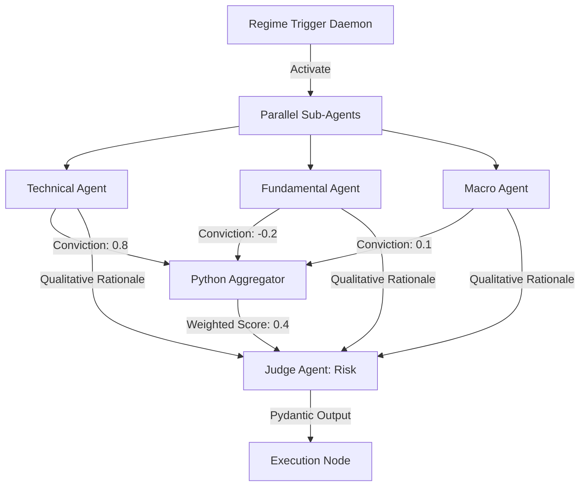

# Agent Topology Overview Implementation

## 1. Architectural Refinement: Ensemble Flow & Dual-Channel Communication
Relying on a single Manager LLM to delegate, synthesize, and execute creates a single point of failure (SPOF) and a severe bottleneck. The topology is reimagined as an **Ensemble Flow Architecture** built upon deterministic Directed Acyclic Graphs (DAGs).

### 1.1 Core Topology Shifts
- **Ensemble Voting over Dictatorship**: The Orchestrator is no longer a monolithic LLM. Instead, it is a deterministic Python script that calculates a weighted average of `ConvictionScore` (-1.0 to 1.0) outputs from the independent Sub-Crews (Technical, Fundamental, Macro).
- **Dual-Channel Protocols**: To retain both quantitative precision and qualitative nuance, agents output two payloads:
  1. `quantitative_payload`: A strict Pydantic JSON for deterministic mathematical weighting.
  2. `qualitative_rationale`: A short textual explanation (max 100 words) passed explicitly to the Judge Agent for final nuance evaluation.
- **Transparent Trust Decay**: Agent "trust scores" are not hidden in an LLM's context window. They are explicitly calculated via historical Brier scores and stored in a PostgreSQL database, directly informing the deterministic ensemble weights.

## 2. The Analytical Ecosystem Layout
1. **Trigger & Regime Daemon (Python)**: Continuously monitors the market and deterministically triggers the DAG without LLM latency.
2. **Parallel Sub-Agents (LLMs)**: Fundamental, Technical, Sentiment, and Macro agents run concurrently, outputting Dual-Channel payloads.
3. **Deterministic Aggregator (Python)**: Averages conviction scores mathematically based on transparent Trust DB weights.
4. **Judge / Risk Manager (Premium LLM)**: Receives the aggregated numerical score and qualitative rationales, ensuring it fits within the strict Pydantic execution schema.
5. **Execution API Wrapper (Python)**: Handles live connection to Alpaca.

## 3. Mermaid Diagram: Agent Topology



## 4. Database Schema: Trust Decay

```sql
CREATE TABLE agent_trust_weights (
    agent_id VARCHAR(50) PRIMARY KEY,
    current_weight DECIMAL(4, 3),
    historical_brier_score DECIMAL(5, 4),
    last_updated TIMESTAMP,
    consecutive_failures INT
);
```

## 5. Constraint Awareness ($100 Micro-Capital)
By eliminating the Manager LLM dictating tasks in a conversational loop, the system saves substantial token costs. The parallel nature of the DAG means the system can evaluate an asset across four domains simultaneously, minimizing latency to capitalize on micro-inefficiencies in the market before larger players arbitrage them away.
