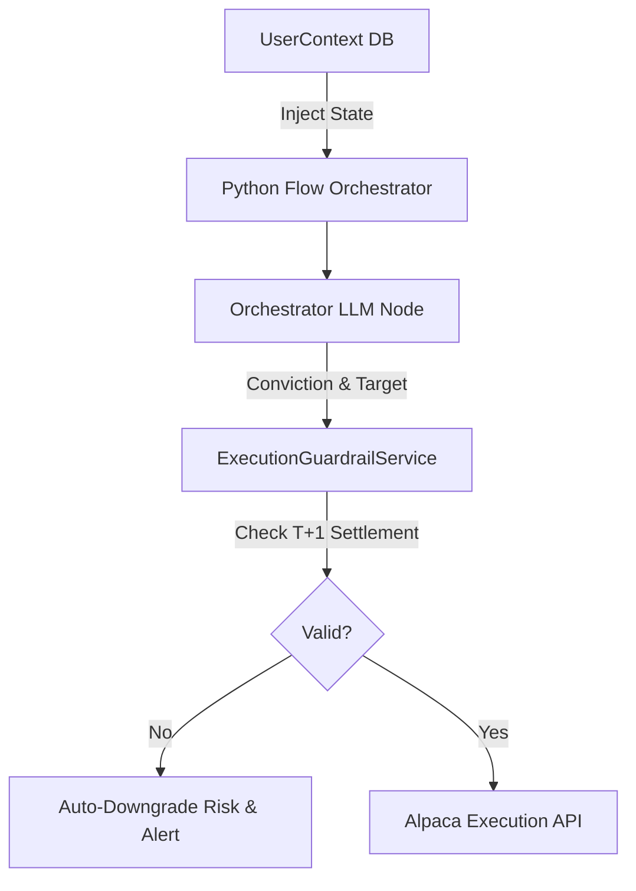

# Main Orchestrator Agent Implementation

## 1. Architectural Refinement: Constrained Autonomy
The concept of the "Autonomous Orchestrator" is refined to prioritize safety, determinism, and immutability. An LLM acting as a free-thinking manager managing regulatory rules is a critical vulnerability.

### 1.1 Strip Regulatory Logic from Prompts
- **Semantic Saturation**: Packing an LLM prompt with complex instructions like "Do not violate T+1 settlement or Good Faith Violations" leads to attention override during market excitement.
- **Python Guardrails**: All regulatory math and capital compliance rules are entirely stripped from the LLM. The Orchestrator's LLM prompt is kept strictly qualitative: "Synthesize the provided data. Output your true conviction score." A rigid Python `ExecutionGuardrailService` acts as an absolute proxy before execution.

### 1.2 State Injection over Tool Fetching
- The LLM does not waste turns or tokens calling a `UserContextFetchTool`. The user's constraints (e.g., Risk Profile) are pre-fetched by the Python Flow and injected dynamically into the LLM state prior to invocation.
- **Asynchronous Risk Profiles**: If systemic risk breaches threshold limits, the system *autonomously downgrades* the profile to "Conservative." It never pauses to ask the user. Explicit user approval is only required to *upgrade* the risk profile.

## 2. Immutable Triggers & Statistical Validity
- **No Self-Modifying Code**: The agent is absolutely forbidden from autonomously rewriting execution or triggering Python scripts. 
- **Parameter Store**: Triggering logic reads from a PostgreSQL `Trigger_Params` table. The Meta-Review Agent can propose updates to these parameters (e.g., changing RSI entry from 30 to 25).
- **Statistical Pre-Validation**: Before updating `Trigger_Params`, the system enforces a deterministic `HistoricalBacktestTool`. The parameter update is rejected unless it demonstrates positive Expected Value across a 6-month rolling window, preventing short-term regime curve-fitting.

## 3. Mermaid Diagram: Guardrails & Context



## 4. Code Structure: Python Guardrail

```python
class ExecutionGuardrailService:
    def __init__(self, portfolio_state: dict):
        self.settled_cash = portfolio_state['settled_cash']
        self.open_positions = portfolio_state['open_positions']

    def validate_trade(self, proposed_trade: dict) -> bool:
        # Strict deterministic logic overriding LLM
        required_capital = proposed_trade['price'] * proposed_trade['qty']
        if required_capital > self.settled_cash:
            raise GFVViolationError("Trade exceeds settled cash limit.")
        return True
```

## 5. Constraint Awareness ($100 Micro-Capital)
By relying on `ExecutionGuardrailService`, the system guarantees that it will never accidentally deploy unsettled funds, a strict requirement when dealing with tight margins and PDT/GFV regulatory rules. Banning self-modifying code prevents runaway logic from decimating the small capital pool.
