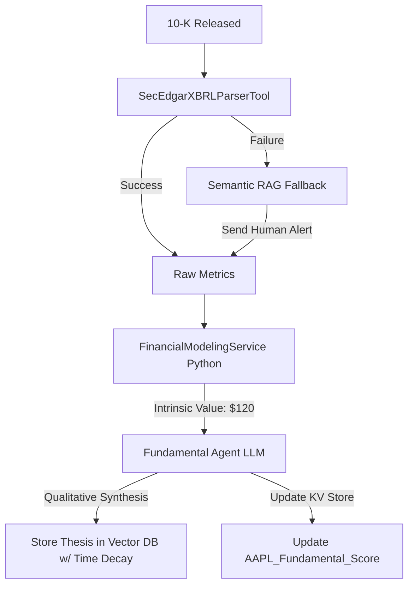

# Fundamental Analyst Agent Implementation

## 1. Architectural Refinement: Deterministic Analysis
The Fundamental Analyst Agent manages the deepest data within the system—SEC filings and financial models. To ensure institutional-grade accuracy, we transition away from LLM "self-healing" code and hallucinatory LLM arithmetic.

### 1.1 Immutable Tooling & Fallback Cascades
- **No Self-Rewriting Parsing**: The agent cannot dynamically rewrite `SecEdgarXBRLParserTool.py` if SEC tags change. This prevents critical execution sandbox breaches.
- **RAG Fallback**: If the deterministic XBRL Parser fails, the Python Flow catches the exception and cascades to a fallback **Semantic RAG Tool**. The filing is chunked into a ChromaDB instance, and the LLM extracts the missing data securely via prompt. An async alert is sent to a human developer to patch the Python tool, maintaining system uptime.

### 1.2 Arithmetic Abstraction
- **No LLM Math**: LLMs cannot reliably calculate multi-year Discounted Cash Flow (DCF) models. The Fundamental Agent is strictly forbidden from attempting DCF math.
- **Python Financial Service**: The Flow routes parsed SEC metrics directly into a `FinancialModelingService` (utilizing `numpy` and `pandas`) which calculates the strict Intrinsic Value. The LLM only receives this absolute value and provides *qualitative synthesis* (e.g., comparing the DCF target to macro risks).

## 2. Thesis Evolution & State Persistence
- **Time-Decayed Retrieval**: Standard vector databases retrieve purely on semantic similarity, which can return stale, outdated theses. The RAG system implements a custom retriever weighted by `timestamp`. Older theses are exponentially decayed, ensuring the Orchestrator always views the latest chronologically validated logic.
- **Key-Value State Isolation**: Quantitative conviction scores are stored as numerical state variables in PostgreSQL or Redis (e.g., `AAPL_Fundamental_Score: 0.8`). They are never stored as text embeddings in a vector database, completely separating mathematical state from qualitative narrative search.

## 3. Mermaid Diagram: Fundamental Workflow



## 4. Code Structure: Time-Decayed Retrieval

```python
from chromadb import Client

class TimeDecayedRetriever:
    def __init__(self, db_client: Client):
        self.collection = db_client.get_collection("fundamental_theses")

    def retrieve_latest_thesis(self, ticker: str, current_time: int):
        results = self.collection.query(
            query_texts=[f"Fundamental thesis for {ticker}"],
            n_results=10
        )
        
        # Apply deterministic exponential decay to similarity score
        best_thesis = None
        highest_score = -1
        
        for doc, meta, distance in zip(results['documents'][0], results['metadatas'][0], results['distances'][0]):
            age_days = (current_time - meta['timestamp']) / 86400
            time_weighted_score = (1.0 / distance) * (0.9 ** age_days) 
            
            if time_weighted_score > highest_score:
                highest_score = time_weighted_score
                best_thesis = doc
                
        return best_thesis
```

## 5. Constraint Awareness ($100 Micro-Capital)
By relying strictly on XBRL parsers and `numpy` for data extraction and calculation, the system minimizes the extreme token costs associated with passing entire 10-K filings into LLM context windows. RAG is only used as an emergency fallback, preserving the micro-capital budget.
