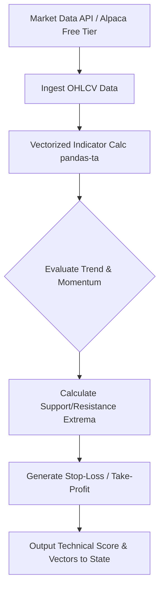

# Technical Analyst Agent Implementation Guide

## 1. Overview and Constraints
The Technical Analyst Agent is a strictly deterministic system designed to evaluate price action, momentum, and volatility. Given the **$100 micro-capital constraint**, the agent must operate with extreme precision. Transaction costs (even minimal ones) and slippage can rapidly deplete the portfolio. Therefore, the agent emphasizes highly accurate entry and exit vectors using fractional shares and free data sources.

## 2. Recommended Frameworks and Libraries
To keep operational costs near zero, we utilize open-source Python libraries and free-tier data providers:
*   **Data Acquisition**: `alpaca-trade-api` (Free Tier for historical market data) or `yfinance` for OHLCV data.
*   **Data Processing**: `pandas` and `numpy` for high-performance vectorized operations.
*   **Technical Analysis**: `ta` (Technical Analysis Library in Python) or `pandas-ta` to rapidly compute RSI, MACD, Bollinger Bands, and VWAP.
*   **Agent Abstraction**: Standard Python classes interacting with the broader LangGraph state.

## 3. Data Ingestion & Schema
Data should be structured as a standard Pandas DataFrame with Datetime indexing.

### OHLCV Schema
```python
import pandas as pd
from pydantic import BaseModel, Field

class TechnicalMetrics(BaseModel):
    rsi_14: float = Field(..., description="14-period Relative Strength Index")
    macd: float = Field(..., description="MACD line")
    macd_signal: float = Field(..., description="MACD Signal line")
    vwap: float = Field(..., description="Volume Weighted Average Price")
    bb_upper: float = Field(..., description="Bollinger Bands Upper")
    bb_lower: float = Field(..., description="Bollinger Bands Lower")
    support_level: float = Field(..., description="Immediate dynamic support level")
    resistance_level: float = Field(..., description="Immediate dynamic resistance level")
```

## 4. Implementation Logic
The agent operates through a multi-step deterministic pipeline:
1.  **Fetch OHLCV**: Retrieve the last 100 periods of M15 (15-minute) or H1 (1-hour) data.
2.  **Calculate Indicators**: Vectorized computation of RSI, MACD, BB, VWAP using `pandas-ta`.
3.  **Identify Support/Resistance**: Algorithmically find local minima and maxima over a rolling window.
4.  **Signal Generation**: Produce a composite technical score (-1.0 to 1.0).
5.  **Risk Parameterization**: Output explicit Stop-Loss (e.g., 1 ATR below support) and Take-Profit (e.g., nearest resistance) levels.

### Example Code Structure
```python
import pandas_ta as ta

class TechnicalAnalystAgent:
    def __init__(self, symbol: str):
        self.symbol = symbol

    def analyze(self, df: pd.DataFrame) -> dict:
        # 1. Compute Indicators
        df.ta.rsi(length=14, append=True)
        df.ta.macd(append=True)
        df.ta.bbands(append=True)
        df.ta.vwap(append=True)

        # 2. Extract Latest State
        latest = df.iloc[-1]
        
        # 3. Dynamic Stop Loss & Take Profit (ATR Based)
        df.ta.atr(length=14, append=True)
        atr = latest['ATRr_14']
        current_price = latest['close']
        
        stop_loss = current_price - (1.5 * atr)
        take_profit = current_price + (3.0 * atr)

        return {
            "symbol": self.symbol,
            "technical_score": self._calculate_score(latest),
            "stop_loss": stop_loss,
            "take_profit": take_profit,
        }
    
    def _calculate_score(self, row) -> float:
        # Heuristic scoring logic
        score = 0.0
        if row['RSI_14'] < 30: score += 0.5 # Oversold
        elif row['RSI_14'] > 70: score -= 0.5 # Overbought
        return score
```

## 5. Architectural Flow (Mermaid Diagram)



## 6. Micro-Capital ($100) Constraints Mitigation
*   **Volatility Targeting**: The agent must avoid highly volatile pennystocks where slippage exceeds the $100 account's risk tolerance. It should filter out assets with an Average True Range (ATR) percentage greater than a safe threshold (e.g., > 5% per day).
*   **Exact Vectors**: Stop-losses are non-negotiable. The agent *must* return a precise stop-loss that risks no more than $1-2 per trade (1-2% of total account capital).
