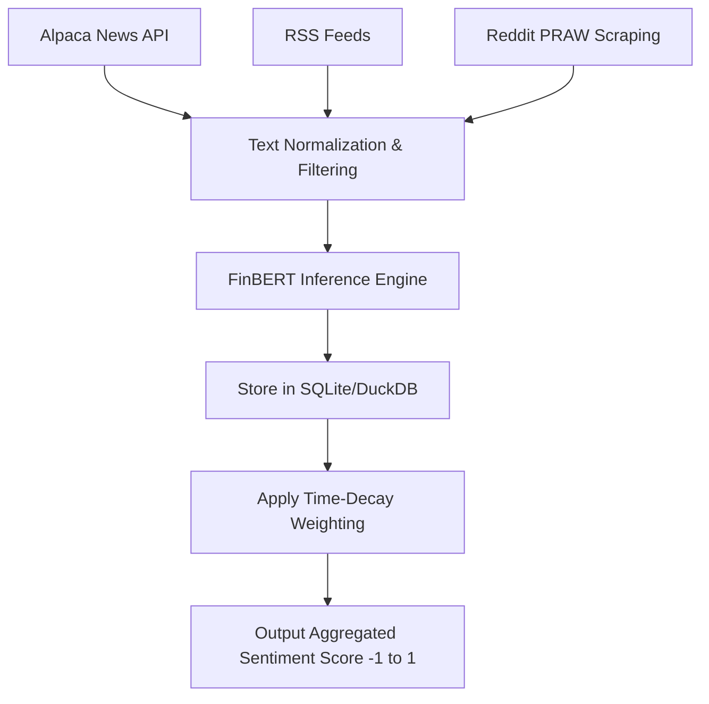

# Sentiment & News Analyst Agent Implementation Guide

## 1. Overview and Constraints
The Sentiment Analyst Agent translates qualitative, unstructured global narratives (news, social media) into quantifiable momentum metrics. Under the **$100 micro-capital constraint**, the system cannot afford enterprise-grade sentiment APIs (like Bloomberg Terminals). Instead, it must rely on free news firehoses, RSS feeds, and highly optimized local or cost-effective NLP models.

## 2. Recommended Frameworks and Libraries
*   **Data Aggregation**: `feedparser` (for RSS feeds), Alpaca News API (free tier), or Finnhub free tier API. `praw` for Reddit scraping (r/WallStreetBets, r/StockMarket).
*   **NLP Engine**: 
    *   *Local Option*: Hugging Face `transformers` using `ProsusAI/finbert` (a financial domain-specific BERT model). Runs locally to eliminate API costs.
    *   *LLM Option*: Pass summaries through a lightweight LLM (e.g., `gpt-4o-mini` or Llama 3) via LangChain.
*   **Database**: SQLite or DuckDB for lightweight, embedded storage of news artifacts to prevent redundant API calls.

## 3. Data Ingestion & Schema
Data is collected asynchronously and stored locally before batch sentiment processing.

### Artifact Schema
```sql
CREATE TABLE IF NOT EXISTS sentiment_artifacts (
    id TEXT PRIMARY KEY,
    symbol TEXT,
    source TEXT,
    published_at DATETIME,
    headline TEXT,
    snippet TEXT,
    finbert_score REAL,
    is_processed BOOLEAN
);
```

## 4. Implementation Logic
1.  **Poll Firehoses**: Asynchronously fetch the latest news headlines and Reddit posts related to the target ticker.
2.  **Filter Noise**: Use basic keyword matching to ensure the artifact is materially relevant to the ticker, dropping spam.
3.  **Calculate Sentiment**: Pass text chunks through FinBERT to extract Positive, Negative, or Neutral logits. Convert to a normalized `-1.0` to `1.0` score.
4.  **Time-Decay Aggregation**: Recent news has a higher weight than news from 24 hours ago. Apply an exponential decay function to aggregate the final sentiment score.

### Example Code Structure
```python
from transformers import pipeline
import math
from datetime import datetime, timezone

class SentimentAnalystAgent:
    def __init__(self):
        # FinBERT is specifically trained on financial text
        self.nlp = pipeline("sentiment-analysis", model="ProsusAI/finbert")

    def evaluate_text(self, text: str) -> float:
        result = self.nlp(text)[0]
        label = result['label']
        score = result['score']
        
        if label == 'positive':
            return score
        elif label == 'negative':
            return -score
        else:
            return 0.0

    def aggregate_sentiment(self, artifacts: list[dict]) -> float:
        total_score = 0.0
        total_weight = 0.0
        now = datetime.now(timezone.utc)
        
        for item in artifacts:
            # Exponential decay based on age in hours
            age_hours = (now - item['published_at']).total_seconds() / 3600
            weight = math.exp(-0.1 * age_hours) 
            
            total_score += item['score'] * weight
            total_weight += weight
            
        return total_score / total_weight if total_weight > 0 else 0.0
```

## 5. Architectural Flow (Mermaid Diagram)



## 6. Micro-Capital ($100) Constraints Mitigation
*   **Beware Pump-and-Dumps**: Micro-cap trading strategies are highly susceptible to sudden momentum shifts. The Sentiment Agent MUST severely penalize extreme social media sentiment (e.g., massive spikes in Reddit mentions with no underlying fundamental news), acting as a filter against entering artificially inflated penny stocks.
*   **Cost Minimization**: Relying strictly on local Hugging Face FinBERT inference prevents accumulating SaaS NLP API fees.
