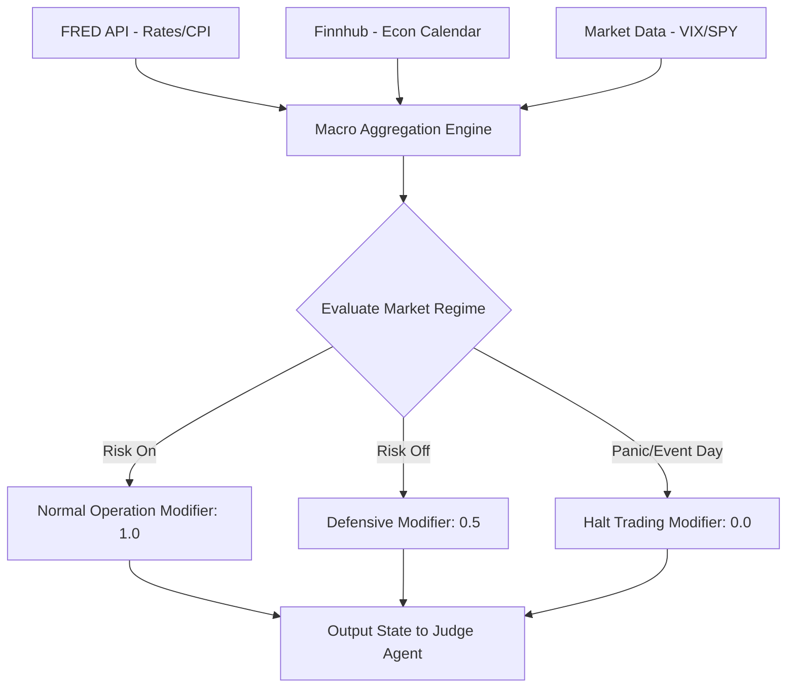

# Macro Analyst Agent Implementation Guide

## 1. Overview and Constraints
The Macro Analyst Agent serves as the overarching systemic guardian. It ensures that the autonomous system does not deploy capital against massive macroeconomic headwinds (e.g., buying tech stocks moments before an unexpected Fed rate hike). With a **$100 account constraint**, systemic drawdown is an existential threat. The system cannot afford to average down or wait out macro cyclical downturns.

## 2. Recommended Frameworks and Libraries
*   **Data Providers**: 
    *   `fredapi` (Federal Reserve Economic Data): 100% free API for US economic data (CPI, Yield Curve, GDP).
    *   Finnhub (Free Tier): For upcoming economic calendars and scheduled Fed speaker events.
*   **Frameworks**: Python with `pandas` for processing macro time-series data. 
*   **Storage**: Local JSON cache or simple SQLite database. Macro data changes slowly (daily/monthly), so heavy database infrastructure is unnecessary.

## 3. Data Schema and Core Indicators
The agent tracks systemic state variables rather than individual ticker data.

```json
{
  "macro_state": {
    "yield_curve_inverted": true,
    "cpi_trend": "accelerating",
    "fed_funds_rate": 5.25,
    "next_fomc_meeting_days": 12,
    "vix_level": 24.5
  },
  "systemic_risk_flag": "HIGH",
  "market_regime": "RISK_OFF"
}
```

## 4. Implementation Logic
The agent utilizes a rules-based expert system combined with LLM summarization.
1.  **Event Calendar Check**: Checks if a major macro event (e.g., CPI release, FOMC press conference) is happening *today*. If yes, it sets a "No-Trade" or "High Volatility" flag.
2.  **Trend Alignment**: Analyzes the SPY/QQQ 200-day moving averages. If the broader market is in a downtrend, it requires higher conviction scores from the Fundamental Agent to authorize a long trade.
3.  **Yield Curve & VIX**: Tracks the 10Y-2Y Treasury yield spread and the VIX. VIX > 30 triggers automatic position sizing reductions.

### Example Code Structure
```python
from fredapi import Fred
import pandas as pd

class MacroAnalystAgent:
    def __init__(self, fred_api_key: str):
        self.fred = Fred(api_key=fred_api_key)

    def get_macro_regime(self) -> dict:
        # Fetch 10-Year Treasury Minus 2-Year Treasury
        yield_curve = self.fred.get_series('T10Y2Y').dropna()
        is_inverted = yield_curve.iloc[-1] < 0
        
        # Example VIX check (would be fetched via yfinance or alpaca)
        vix_level = 20.0 
        
        regime = "RISK_ON"
        risk_modifier = 1.0
        
        if is_inverted or vix_level > 25:
            regime = "RISK_OFF"
            risk_modifier = 0.5 # Tell Judge to halve position sizes
            
        if vix_level > 35:
            regime = "PANIC"
            risk_modifier = 0.0 # Halt trading
            
        return {
            "regime": regime,
            "position_size_modifier": risk_modifier,
            "systemic_warning": is_inverted
        }
```

## 5. Architectural Flow (Mermaid Diagram)



## 6. Micro-Capital ($100) Constraints Mitigation
*   **Capital Preservation over Yield**: Because the $100 portfolio cannot absorb severe drawdowns, the Macro Agent acts as an emergency brake. If macro conditions are unstable, it outputs a strict `risk_modifier` of `0.0`, forcing the system into cash. Earning 0% in a cash sweep is better than losing 20% due to an unexpected macro shock.
