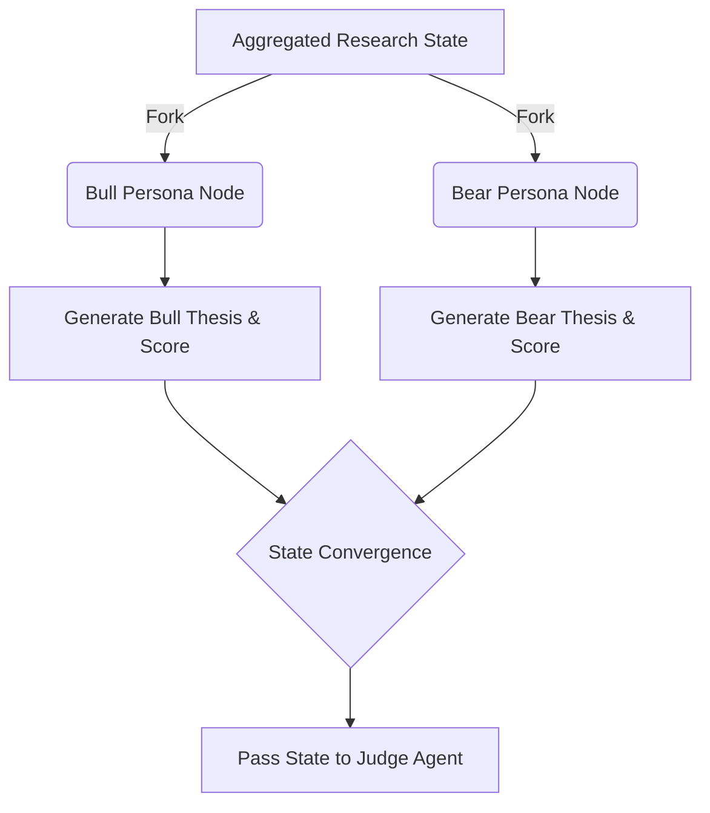

# The Debate Workflow (Bull & Bear) Implementation Guide

## 1. Overview and Constraints
The Debate Workflow counters LLM confirmation bias by forcing two distinct agent personas (Bull and Bear) to analyze the same aggregated data (Fundamental, Technical, Sentiment, Macro) and argue opposing viewpoints. Operating autonomously within a **$100 constraint**, this must be executed using a highly deterministic state machine to avoid infinite LLM loops and excessive API costs.

## 2. Recommended Frameworks and Libraries
*   **Orchestration**: `langgraph` (LangChain's graph framework for stateful, multi-actor applications). It is perfect for managing dialectical states and enforcing parallel execution.
*   **LLM Integration**: `langchain_core` and `langchain_openai` (or `langchain_anthropic`). To save costs, utilize `gpt-4o-mini` or `claude-3-haiku`.
*   **State Management**: Python `TypedDict` to manage the DebateState.

## 3. Data Schema & State Definition
In LangGraph, the workflow state acts as a shared memory between nodes.

```python
from typing import Annotated, TypedDict
import operator

class DebateState(TypedDict):
    ticker: str
    aggregated_data: dict          # Data from Tech, Fund, Sent, Macro
    bull_argument: str             # Bull's generated thesis
    bull_score: float              # 0 to 10
    bear_argument: str             # Bear's generated thesis
    bear_score: float              # 0 to 10
    debate_complete: bool
```

## 4. Implementation Logic
1.  **Parallel Execution**: The state graph forks, sending the `aggregated_data` to both the Bull Node and the Bear Node simultaneously. This saves time and prevents one agent from inappropriately anchoring to the other's initial prompt.
2.  **Persona Prompts**:
    *   *Bull Prompt*: "You are a hyper-optimistic portfolio manager. Using ONLY the provided data, build the strongest possible bull case. Return a score from 0-10."
    *   *Bear Prompt*: "You are a ruthless short-seller. Using ONLY the provided data, identify every flaw, risk, and downside potential. Return a score from 0-10."
3.  **State Convergence**: Both nodes update the `DebateState` and converge to a final synthesis node or pass directly to the Judge Agent.

### Example Code Structure
```python
from langgraph.graph import StateGraph, END
from langchain_core.prompts import ChatPromptTemplate
# ... setup LLM ...

def bull_node(state: DebateState):
    # System prompt enforcing bullish persona
    prompt = f"Argue the BULL case for {state['ticker']} based on: {state['aggregated_data']}"
    response = llm.invoke(prompt) # Expect structured output (score, argument)
    return {"bull_argument": response.argument, "bull_score": response.score}

def bear_node(state: DebateState):
    # System prompt enforcing bearish persona
    prompt = f"Argue the BEAR case for {state['ticker']} based on: {state['aggregated_data']}"
    response = llm.invoke(prompt)
    return {"bear_argument": response.argument, "bear_score": response.score}

# Build LangGraph
workflow = StateGraph(DebateState)
workflow.add_node("bull", bull_node)
workflow.add_node("bear", bear_node)

# Parallel execution from start
workflow.set_entry_point("bull") # In advanced setup, use branching
workflow.set_entry_point("bear")

workflow.add_edge("bull", END)
workflow.add_edge("bear", END)
app = workflow.compile()
```
*(Note: True parallel branching in LangGraph is achieved using conditional edges or parallel fan-out mappings).*

## 5. Architectural Flow (Mermaid Diagram)



## 6. Micro-Capital ($100) Constraints Mitigation
*   **Strict Token Limits**: LLMs love to talk. To preserve the $100 account from being drained by API fees, the Bull and Bear prompts MUST include strict output constraints (e.g., "Limit your argument to 3 bullet points. Output exactly 150 words.").
*   **One-Shot Debate**: Unlike standard conversational agents, the debate is single-turn. There is no back-and-forth arguing, which would incur recursive LLM costs. They both provide their thesis once, and the Judge decides.
