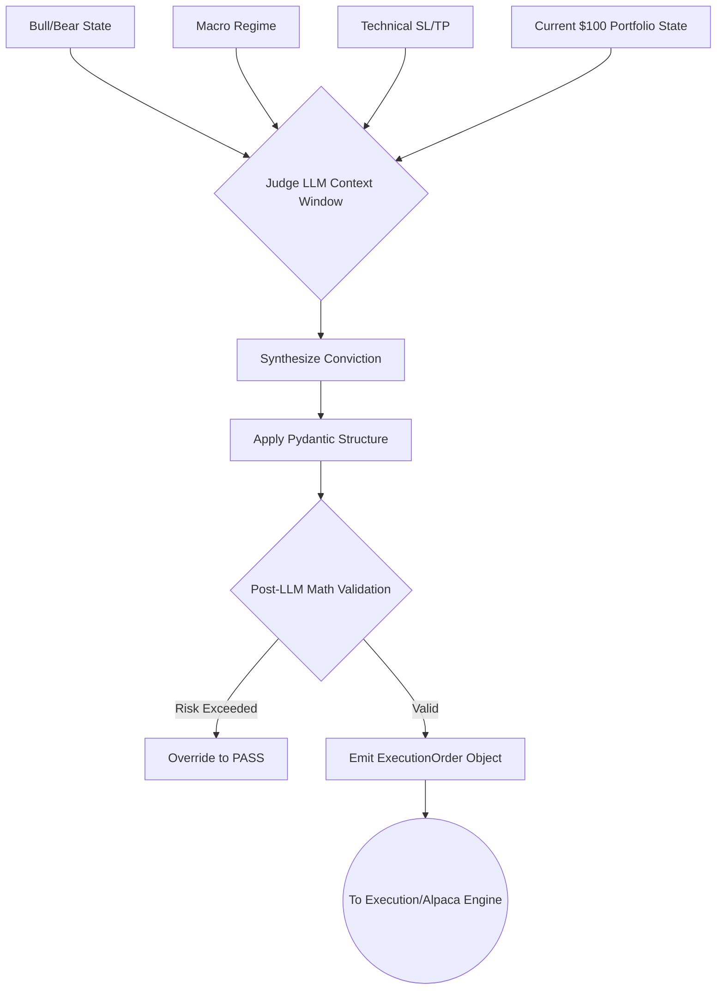

# The Judge (Risk Manager) Agent Implementation Guide

## 1. Overview and Constraints
The Judge Agent is the final, non-negotiable gateway before a trade is executed. It evaluates the dialectical debate (Bull vs. Bear scores), the Macro regime flag, and the Technical entry/exit vectors. Critically, it operates under absolute **$100 micro-capital constraints**, meaning it must calculate exact fractional share quantities, enforce strict stop-losses, and ensure no trade risks more than a tiny fraction of the portfolio (e.g., 2% max risk = $2.00).

## 2. Recommended Frameworks and Libraries
*   **Structured Output Engine**: `pydantic` combined with `instructor` or LangChain's `.with_structured_output()`. The Judge MUST NOT output free-text. It must output a strict JSON/Pydantic object to ensure API execution safety.
*   **Execution Integration**: `alpaca-trade-api` (specifically the fractional shares and OCO - One-Cancels-the-Other order types).

## 3. Data Schema & Pydantic Output
The Judge receives the entire `DebateState` and the current `PortfolioState`, and outputs an `ExecutionOrder`.

```python
from pydantic import BaseModel, Field
from typing import Literal, Optional

class ExecutionOrder(BaseModel):
    ticker: str = Field(..., description="Asset symbol")
    action: Literal["BUY", "HOLD", "PASS", "SELL"] = Field(..., description="Execution decision")
    confidence_score: float = Field(..., ge=0.0, le=10.0, description="Overall conviction")
    
    # Capital Constraints
    fractional_quantity: float = Field(0.0, description="Exact fractional shares to buy")
    allocated_capital: float = Field(0.0, description="Total dollar amount allocated (Max $10)")
    
    # Risk Vectors (Required if Action is BUY)
    stop_loss_price: Optional[float] = Field(None, description="Hard stop loss price")
    take_profit_price: Optional[float] = Field(None, description="Take profit target")
    
    reasoning: str = Field(..., description="Brief one-sentence justification")
```

## 4. Implementation Logic
1.  **Synthesize Scores**: The Judge calculates the net conviction score (`bull_score - bear_score`).
2.  **Apply Macro Filter**: If the Macro Agent flagged `position_size_modifier = 0.0`, the Judge overrides all bullish data and outputs `action = "PASS"`.
3.  **Capital Sizing Math (Risk Parity)**: 
    *   *Total Account*: $100.00
    *   *Max Risk per Trade*: 2% ($2.00).
    *   *Distance to Stop Loss*: Calculated from the Technical Agent. If Entry is $50, and Stop Loss is $48, risk per share is $2.00.
    *   *Position Sizing*: The Judge calculates exactly how many fractional shares can be bought without exceeding the $2.00 max risk.
4.  **Format Output**: LLM generates the Pydantic model. If it fails validation, it triggers a retry or defaults to "PASS".

### Example Code Structure
```python
class JudgeAgent:
    def __init__(self, llm_with_structured_output, portfolio_cash: float):
        self.llm = llm_with_structured_output
        self.portfolio_cash = portfolio_cash
        self.max_risk_dollars = 2.00 # 2% of $100

    def evaluate(self, debate_state: dict, tech_state: dict, macro_state: dict) -> ExecutionOrder:
        # 1. Hard Rules Engine (Non-LLM)
        if macro_state['regime'] == "PANIC":
            return ExecutionOrder(ticker=debate_state['ticker'], action="PASS", confidence_score=0.0, reasoning="Macro panic halt.")
            
        # 2. LLM Synthesis
        prompt = f"""
        Act as the Risk Manager. Evaluate this setup:
        Bull: {debate_state['bull_score']}
        Bear: {debate_state['bear_score']}
        Technical Stop: {tech_state['stop_loss']}
        Available Cash: ${self.portfolio_cash}
        """
        
        # Enforce Pydantic Output
        decision = self.llm.invoke(prompt) # Returns ExecutionOrder object
        
        # 3. Post-LLM Math Validation (Trust but Verify)
        if decision.action == "BUY":
            risk_per_share = tech_state['current_price'] - decision.stop_loss_price
            max_shares = self.max_risk_dollars / risk_per_share
            decision.fractional_quantity = min(max_shares, decision.fractional_quantity)
            decision.allocated_capital = decision.fractional_quantity * tech_state['current_price']
            
            # Ensure we don't spend more than we have
            if decision.allocated_capital > self.portfolio_cash:
                 decision.action = "PASS"
                 decision.reasoning = "Insufficient settled cash."
                 
        return decision
```

## 5. Architectural Flow (Mermaid Diagram)



## 6. Micro-Capital ($100) Constraints Mitigation
*   **Bracket Orders**: Because the system is autonomous and dealing with micro-capital, manual intervention to cut losses is impossible. The Judge's output is directly translated into an Alpaca API **OTOCO** (One-Triggers-One-Cancels-Other) order. This means the entry, stop-loss, and take-profit are submitted to the broker simultaneously.
*   **Hallucination Prevention**: The Pydantic schema is strictly enforced. If the LLM hallucinates an invalid string instead of a float for the quantity, the system natively raises a Python validation error and fails safely into a "HOLD/PASS" state.
