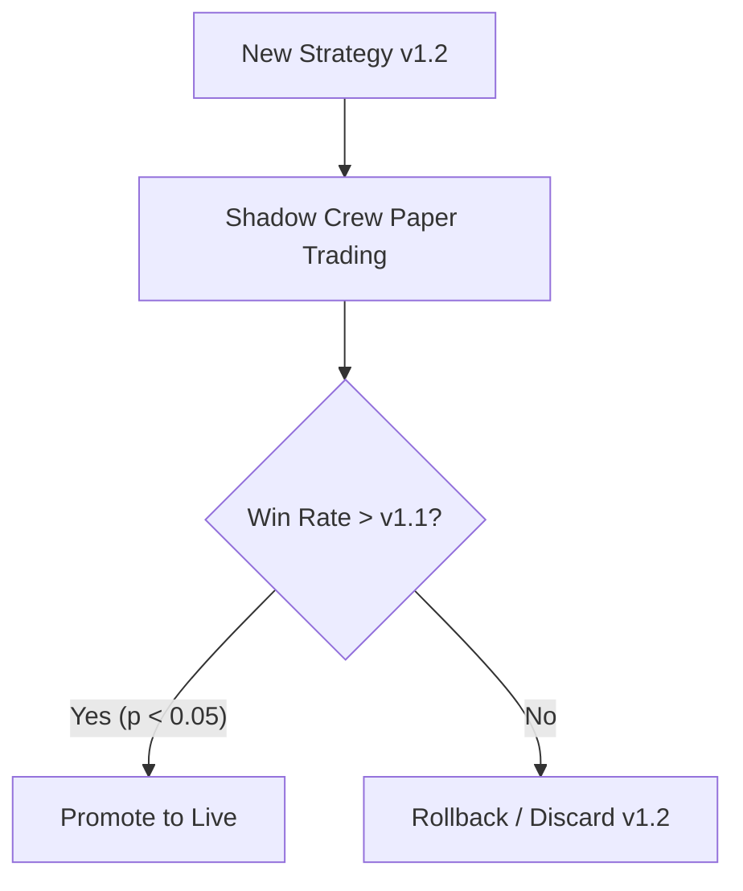

# Implementation Details: Reflexion Framework and Self-Evolution

## Overview
This document outlines the implementation strategy for the **Reflexion Framework** within our multi-agent quantitative trading system. The goal is to allow agents to learn from trading outcomes iteratively without falling into the traps of hindsight bias, prompt saturation, or identity drift. To preserve the $100 micro-capital constraint, we avoid runaway API costs and prioritize statistical rigor.

---

## 1. Brier Score & Deterministic Evaluation

### The "Hindsight Bias" Problem
Evaluating a stochastic decision based solely on its singular outcome leads to over-correction. Instead, we decouple the *decision quality* from the *market outcome*.

### Implementation
- **Brier Score Engine**: Rather than labeling agents "Accurate" or "Inaccurate", we evaluate their probabilistic predictions across a rolling 30-trade window.
  - Formula: `Brier Score = (1/N) * sum((predicted_probability - actual_outcome)^2)`
- **Market Context Replay Tool**: The Meta-Review Crew runs post-market. It is provided a deterministic state capture of the exact data available at the moment of the trade. It evaluates whether the agent adhered to its mathematical constraints, completely ignoring the final PnL.

```python
def calculate_brier_score(predictions: List[float], outcomes: List[int]) -> float:
    """Calculates the Brier Score for an agent's probability outputs."""
    if not predictions: return 0.0
    return sum((p - o)**2 for p, o in zip(predictions, outcomes)) / len(predictions)
```

---

## 2. Linguistic Feedback via RAG & Rule Consolidation

### The "Prompt Saturation" Problem
Appending every harsh critique to an agent's system prompt will cause attention collapse. 

### Implementation
- **Mem0 / Local Vector Database**: We use a self-hosted Qdrant instance. Linguistic modifiers ("rules") are stored as vectors rather than concatenated strings.
- **Rule Consolidator Node**: A deterministic Flow that runs before updating the database. If a new rule contradicts an existing one, the Flow forces the Meta-Review Crew to synthesize them into a "Meta-Rule".
- **Max-Rule Constraint**: During initialization, an agent retrieves a strict maximum of the 3 most relevant linguistic lessons.

> [!TIP]
> Keep the Qdrant instance on the same local network (or within the same Docker compose network) to ensure `<10ms` latency for rule retrieval.

---

## 3. Strict Persona Segmentation & Database Writes

### The "Identity Drift" Problem
If agents can rewrite their own backstories, they might lose their domain expertise (e.g., a Technical Analyst hallucinates macro data).

### Implementation
- **Immutable Core vs. Mutable Strategy**: Backstories are separated into read-only `Identity_Core` and read/write `Strategic_Nuance`.
- **Pydantic Schema Validation**: All updates to `Strategic_Nuance` must pass through a strict Pydantic validator.

```python
from pydantic import BaseModel, field_validator

class AgentUpdate(BaseModel):
    agent_name: str
    strategic_nuance: str
    
    @field_validator('strategic_nuance')
    def enforce_domain_isolation(cls, v, info):
        forbidden_words = ["earnings", "CEO", "CPI", "Fed"]
        if info.data.get('agent_name') == 'Technical_Analyst':
            if any(word.lower() in v.lower() for word in forbidden_words):
                raise ValueError("Technical Analyst cannot incorporate fundamental terms.")
        return v
```

---

## 4. Statistically Significant Prompt Evolution & Shadow Sim

### The "Noise Thrash" Problem
Rolling back prompts after arbitrary consecutive losses reacts to noise.

### Implementation
- **Statistical Significance**: A Python module calculates the Z-Score or T-Test of the new prompt (`v1.2`) win-rate vs the old prompt (`v1.1`) over a minimum of 20 live executions. Rollback only occurs if `p < 0.05`.
- **Parallel Shadow Simulation**: Evolved prompts are deployed to a **Shadow Crew** trading on paper, while `v1.1` continues on live capital. `v1.2` is only promoted to production if it outperforms `v1.1` with statistical significance.


