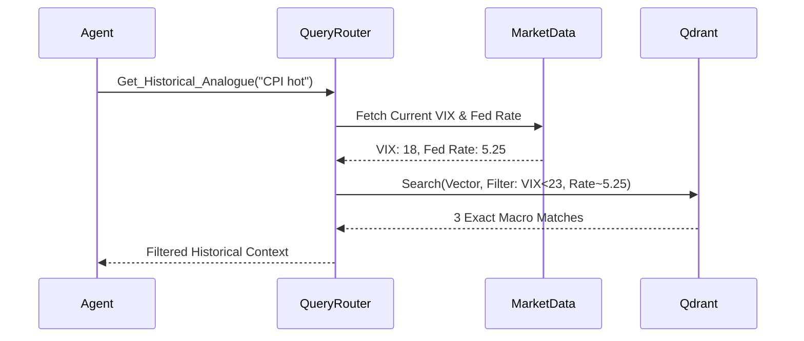

# Implementation Details: Agentic Memory Architecture

## Overview
A robust memory architecture is critical for our multi-agent quantitative trading system. Relying on out-of-the-box framework memory features (like CrewAI's `memory=True`) introduces black-box anchoring bias and latency. This document outlines a precise, deterministic, and self-hosted memory infrastructure designed for the $100 micro-capital constraint.

---

## 1. Explicit State Passing Over Black-Box Memory

### The "Anchoring Bias" Problem
Native agent memory allows models to silently recall past thoughts. If an agent rejects a stock in the morning, it may blindly reject it in the afternoon despite changed conditions.

### Implementation
- **Disable Framework Memory**: Explicitly set `memory=False` in all Crew/Agent instantiations.
- **Pydantic SessionState**: State is passed deterministically between nodes using LangGraph/CrewAI Flows.
- **Time-Gated Recall**: Implement programmatic "forgetfulness" to force re-evaluation on fresh data.

```python
from pydantic import BaseModel
import time

class SessionState(BaseModel):
    analyzed_tickers: dict = {} # e.g. {"AAPL": 1678888888}

def check_time_gated_recall(ticker: str, state: SessionState) -> bool:
    """Returns True if the agent must re-analyze the ticker."""
    last_analyzed = state.analyzed_tickers.get(ticker, 0)
    if (time.time() - last_analyzed) > 3600: # 60 minutes
        return True
    return False
```

---

## 2. Local Self-Hosted Vector Database

### The "Vendor Latency & IP Leak" Problem
Using external cloud APIs (like Mem0 API) introduces network latency that can blow execution windows and risks exposing proprietary alpha strategies.

### Implementation
- **Self-Hosted Qdrant/Chroma**: Deploy a lightweight vector database as a sidecar container to the orchestrator.
- **Asynchronous Writes**: Memory writes must not block the main trading execution thread.
  - Reflections are pushed to a **Redis Queue**.
  - A low-priority Python worker consumes the queue, embeddings using a local model (`all-MiniLM-L6-v2`), and writes to Qdrant.

> [!TIP]
> Using local sentence-transformers saves API costs completely, fitting well within the $100 micro-capital constraint.

---

## 3. Multi-Modal Retrieval (Metadata Filtering)

### The "False Analogue" Problem
Semantic search alone fails in finance. A search for "hot CPI" might return a 2021 journal entry (when rates were low) and incorrectly apply it to 2026 (when rates are high). The texts are semantically identical but macro-economically opposite.

### Implementation
- **Hard Metadata Constraints**: Vector payloads must include strict JSON metadata representing the structural macroeconomic regime.
- **Python Query Router**: Agents cannot directly perform raw semantic searches. They call a Python tool that pre-filters the vector space by current conditions before executing the text similarity search.

```python
def get_historical_analogue(event_text: str, current_vix: float, current_fed_funds: float) -> list:
    """Forces metadata match before semantic search."""
    # Construct Qdrant filter
    filter_query = {
        "must": [
            {"key": "fed_funds_rate", "range": {"gte": current_fed_funds - 0.5, "lte": current_fed_funds + 0.5}},
            {"key": "vix_level", "range": {"lte": current_vix + 5}}
        ]
    }
    # Execute vector search only within filtered subspace
    results = qdrant_client.search(
        collection_name="trading_journal",
        query_vector=encode(event_text),
        query_filter=filter_query,
        limit=3
    )
    return results
```


