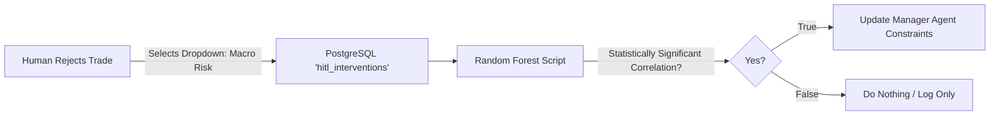

# Implementation Details: Human-in-the-Loop (HITL) Integration

## Overview
While the system is autonomous by default, high-risk conditions require human oversight. Implementing HITL requires extreme care; naive approaches (like hanging a thread while waiting for a webhook) can lead to out-of-memory errors and execution on stale data.

---

## 1. TTL Hard Kills & State Serialization

### The "Synchronization Bottleneck" Problem
Pausing an autonomous orchestration pipeline via async webhooks risks severe state management issues. If the operator approves a trade 2 hours later, the market has moved, leading to disastrous fills.

### Implementation
- **Time-to-Live (TTL)**: The `HumanApprovalTool` is heavily constrained with a strict `timeout=60_seconds`. If no human response is received, the tool automatically assumes a `"System_Reject: Timeout"`.
- **State Serialization**: Instead of blocking the Python thread, the state (ticker, notional, limit price) is serialized to PostgreSQL. The original process terminates.
- **Re-Hydration**: When the human clicks "Approve" via the Telegram webhook, a brand new lightweight process spins up, verifies price drift (<0.1%), and executes.

> [!CAUTION]
> Never let a language model thread hang indefinitely while awaiting human input. Always serialize state, kill the thread, and re-hydrate upon webhook callback.

---

## 2. WebSocket Streaming & The Dead Man's Switch

### The "Polling Gap" Problem
Polling Alpaca's REST API for equity updates every 60 seconds is too slow to catch a flash crash. If the polling daemon crashes, the main execution engine continues unprotected.

### Implementation
- **WebSocket Equity Streaming**: The Overwatch Daemon connects to the Alpaca `account_updates` WebSocket stream for push-based, sub-millisecond awareness.
- **Dead Man's Switch**: The Overwatch Daemon continuously writes a timestamp to Redis every second. The trading engine checks this heartbeat before *any* order submission.

```python
import time
import redis

r = redis.Redis(host='localhost', port=6379, db=0)

def verify_overwatch_daemon():
    """Dead Man's Switch: Validates the risk daemon is alive."""
    last_heartbeat = r.get('overwatch_heartbeat')
    if not last_heartbeat:
        raise Exception("ABORT: Overwatch Daemon heartbeat missing.")
    
    time_since = time.time() - float(last_heartbeat)
    if time_since > 3.0:
        raise Exception(f"ABORT: Overwatch Daemon stale ({time_since}s). Halting execution.")
```

---

## 3. Structured Human Intent & Deterministic Cloning

### The "Spurious Correlation" Problem
If the LLM is tasked with analyzing human rejections from raw text, it will hallucinate incorrect causal links (e.g., assuming a trade was rejected because it was raining).

### Implementation
- **Structured Telegram Webhook**: The Telegram bot enforces inline dropdown buttons for rejection reasons: `[Macro Risk, Technical Disagreement, News Event, Other]`.
- **Deterministic Feature Extraction**: The Meta-Review Crew is banned from autonomous feature extraction. Instead, a deterministic algorithm (e.g., Random Forest on the `hitl_interventions` SQL table) identifies the mathematically highest correlated features to rejections.
- **Rule Generation**: Only if the correlation is statistically significant does the system generate a prompt update mimicking the human's preference.


