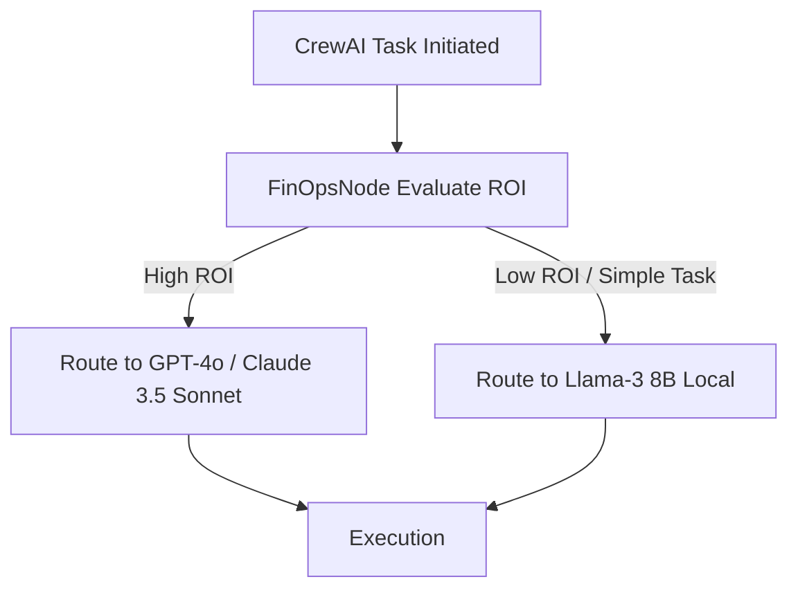

# Implementation Details: Paper Trading (Phase 2)

## Overview
Phase 2 subjects the architecture to live WebSocket streams and real market microstructure using the Alpaca Paper API. This ensures the system handles network turbulence, T+1 settlement constraints, and API cost controls before handling live micro-capital.

---

## 1. Architectural Hard-Segregation & Friction Injection

### The "Sandbox Delta" Problem
A single `IS_PAPER_TRADING = True` flag is a single point of failure that can lead to catastrophic real-world losses. Furthermore, Paper APIs often provide "perfect" fills, lulling the model into bad execution habits.

### Implementation
- **CI/CD Hard-Segregation**: Environments are physically segregated. The Production container cannot access Paper API keys, and the Paper container cannot access Live API keys. AWS Secrets Manager handles injection.
- **FrictionNode Injection**: The system artificially makes the Paper API worse to prepare for live trading. The `AlpacaOrderSubmissionTool` applies randomized latency (200-800ms) and subtracts 0.1% from the fill price, forcing the LLM to learn patience and conservative entries.

> [!IMPORTANT]
> The FrictionNode is the most critical piece of Phase 2. By training the AI in an artificially hostile paper environment, it will excel when deployed to the real world.

---

## 2. Stateless Settlement Calculation (T+1 Enforcement)

### The "Dual-State Drift" Problem
Tracking simulated cash balances in a custom SQLite "shadow ledger" guarantees state drift. If the Python process crashes, funds remain permanently "locked" in the database while Alpaca thinks they are free.

### Implementation
- **Stateless Deterministic Calculation**: We do not store locks. The `CapitalQueryTool` calculates available capital *on the fly*.
- **Mechanism**:
  1. Query Alpaca for all closed trades in the last 48 hours.
  2. Ping an external Federal Holiday API to ensure accurate business day calculation.
  3. Mathematically compute the locked vs. settled funds at the millisecond of the query.
- **Code Immutability**: The LLM is strictly banned from editing this Python settlement logic.

```python
def get_settled_funds(alpaca_client) -> float:
    """Stateless calculation of T+1 settled funds."""
    total_equity = alpaca_client.get_account().equity
    recent_trades = alpaca_client.get_activities(activity_types='FILL')
    
    unsettled_amount = 0.0
    for trade in recent_trades:
        if is_within_t1_window(trade.transaction_time):
            unsettled_amount += float(trade.price) * float(trade.qty)
            
    return float(total_equity) - unsettled_amount
```

---

## 3. FinOps Model Distillation

### The "Over-Correction Amputation" Problem
If API token costs get too high, allowing the system to autonomously "disable" agents or truncate their prompts will lobotomize the trading alpha.

### Implementation
- **Model Swapping over Amputation**: Instead of deleting prompts, the system uses a **FinOpsNode** to dynamically route tasks to cheaper models.
- **Cost-Alpha SLAs**: If the Sentiment Analyst's token cost exceeds its historical alpha contribution, the FinOpsNode intercepts its CrewAI task and routes it to `Llama-3-8B` (via Groq/Local) instead of `GPT-4o`.
- **Rate-Limiting**: Expensive agents are rate-limited to run twice a day instead of continuously, preserving their intelligence while maintaining the strict $100 budget constraints.


