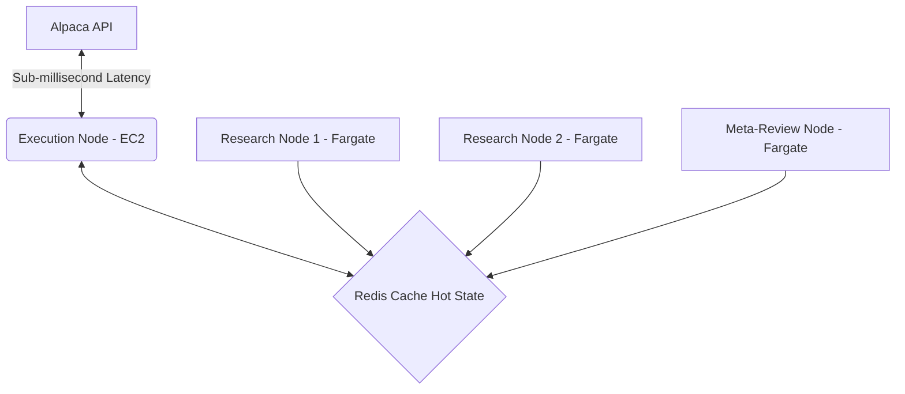

# Implementation Guide: Live Deployment Phase 3

## 1. AWS ECS Deployment Architecture

To ensure millisecond execution latency while maintaining the autonomy of the system, we decouple the Execution Node from the Reasoning Nodes.

### Concrete Framework
* **Execution Node:** Deployed on AWS EC2 (`c6i.large` instance) with Enhanced Networking for deterministic execution. Managed by ECS (EC2 launch type).
* **Reasoning/Research Nodes:** Deployed on AWS Fargate (Serverless) since their computational needs spike dynamically during market events, and a 2-second cold start latency does not critically impact macro/fundamental research.

### Mermaid Diagram: ECS Architecture


## 2. API Key Management & Zero-Trust Secrets

A micro-capital constraint dictates that any leak is fatal.
* **Storage:** AWS Secrets Manager securely stores the `ALPACA_API_KEY` and `OPENAI_API_KEY`.
* **Hydration Process:** We implement a custom bootloader `secret_hydrator.py` utilizing the `boto3` library. The Execution Node runs with an IAM Task Role that only permits `secretsmanager:GetSecretValue`.
* **Zero-Trust Rule:** The AI prompt orchestration layers *never* see the API keys directly. 

## 3. CI/CD for Prompts (Language as Code)

LLM prompts are equivalent to trading logic. They reside in a hot-cache layer, not in Docker images.
* **Storage Layer:** Redis (AWS ElastiCache) holds the active prompts.
* **Pipeline Mechanism:**
  1. The Meta-Review Crew autonomously creates a PR on GitHub proposing a new prompt constraint.
  2. GitHub Actions runs Python schema validations (e.g., `pytest` confirming `ExecutionSignal` structural integrity).
  3. The PR is **Human-Gated**. A human must approve it.
  4. Upon merge, a GitHub Action updates the Redis cache, hot-swapping the logic instantly.

## 4. Slippage and Latency Adaptation

To prevent the $100 account from draining via microscopic slippage, dynamic slippage limits are strictly enforced.
* **Database Schema Addition (PostgreSQL):**
  ```sql
  CREATE TABLE slippage_tracking (
      trade_id UUID PRIMARY KEY,
      ticker VARCHAR(10),
      intended_price NUMERIC,
      fill_price NUMERIC,
      slippage_pct NUMERIC,
      timestamp TIMESTAMP DEFAULT NOW()
  );
  ```
* **Python Implementation:** The `FillReconciliationTool` continuously calculates the rolling 7-day average of `slippage_pct` per asset. The Manager Agent queries this dynamic buffer and explicitly passes it as a strict mathematical limit order constraint (`buffer * 1.5`).

## 5. Blue/Green Strategy Deployment

Transitions must be flawless. Strategy components are tested in a paper environment against real market data before full deployment.
* **The Handoff Protocol:** 
  - **Blue (Live):** Executes logic `v1.0`. Only manages legacy positions it originally opened.
  - **Green (Paper):** Executes `v1.1`. If its 14-day Sharpe Ratio outpaces Blue's by a statistically significant delta (`delta > 0.25`), Green is promoted.
  - Green is only allowed to allocate newly freed cash and *never* liquidates Blue's open positions blindly.

## 6. Compounding Flywheel Execution

* **Tranche Sizing Algorithm:** The system runs a `cron` script every Monday pre-market.
  ```python
  def calculate_tranche(equity: float) -> float:
      base_pct = 0.10
      # As account scales, reduce base pct to preserve wealth
      if equity > 500:
          base_pct = 0.05
      elif equity > 200:
          base_pct = 0.08
      return equity * base_pct
  ```
* **$100 Micro-capital context:** Fractional execution via Alpaca makes it possible to trade a precise $10 (10%) tranche uniformly across chosen assets without being barred by high share prices.
