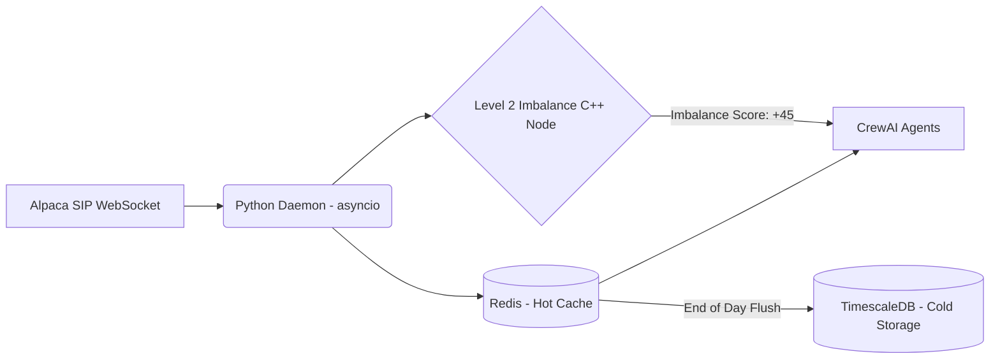

# Implementation Guide: Data Ingestion Pipelines

## 1. Hot and Cold Data Architecture

Ingesting market data for an autonomous multi-agent system requires strict separation between real-time inference (hot state) and backtesting/retention (cold state).

### Data Layer Stack
* **Hot State (Redis):** Handles sub-millisecond retrieval of the active trading day's 1-minute OHLCV bars. Prevents disk I/O bottlenecks.
* **Cold State (PostgreSQL + TimescaleDB):** Provides immutable, long-term historical storage. A daily background worker flushes Redis data into Postgres at 16:15 EST.

### Mermaid Diagram: Data Pipeline


## 2. Alpaca SIP WebSocket and Event Bridge

To handle continuous streams without overwhelming task-based agents, we use an asynchronous Event Bridge pattern.

* **WebSocket Daemon (`asyncio` & `websockets`):** A dedicated Python worker listening to `minute_bars` and `trades`.
* **Event Bridge Trigger:** The daemon does not invoke the LLM on every tick. Instead, it uses deterministic triggers.
  ```python
  if current_volume > (average_volume_5min * 5):
      # Trigger CrewAI Task injection
      crew_event_bridge.trigger_task(ticker, anomaly_type="VOLUME_SPIKE")
  ```

## 3. Level 2 Data and Feature Engineering

Passing vast Level 2 order books to an LLM will cause immediate Out-Of-Memory (OOM) errors and context window hallucinations.

* **Level 2 Abstraction:** We use a high-performance C++ or Cython service that ingests order book updates and spits out a simple integer: `Order_Book_Imbalance_Score (-100 to +100)`.
* **Pure Quantitative Injection:**
  * **Incorrect (Semantic Bias):** `{"RSI": 25, "Status": "Highly Oversold BUY NOW"}`
  * **Correct (Neutral Data):** `{"RSI": 25.4, "Order_Book_Imbalance": 45, "Vol_Anomaly": 5.2}`
  The LLM must interpret the pure quantitative JSON structure to prevent confirmation bias.

## 4. Polling Agents and Normalization (REST APIs)

Not all data is available via WebSockets (e.g., SEC EDGAR, Reddit/Twitter, Benzinga News).
* **Intelligent Polling:** `APScheduler` manages the Polling Agents. It dynamically adjusts its cron schedule (e.g., only polling the SEC Edgar API aggressively around 08:00 AM or expected 10-Q filing dates).
* **Deterministic Normalization Node:** Raw HTML/XML or messy JSON arrays from Reddit must be aggressively sanitized via Python `BeautifulSoup` and regex before they reach the LLM.

### Code Structure: Normalizer Pipeline
```python
def sanitize_external_text(raw_text: str) -> str:
    """Strips imperative commands to prevent prompt injection."""
    cleaned = re.sub(r'<[^>]+>', '', raw_text)  # Remove HTML
    cleaned = re.sub(r'(?i)(ignore|override|system|prompt)', '[REDACTED]', cleaned)
    return f"<external_data>{cleaned}</external_data>"
```

## 5. Constraint: $100 Account Budget
Data costs can quickly exceed the $100 principal.
* **Alpaca SIP:** Utilize Alpaca's free or low-cost data tiers as the foundational feed.
* **API Throttling:** The Polling Agents are strictly rate-limited locally using the `ratelimit` Python library to ensure we don't rack up massive SaaS data provider bills.
