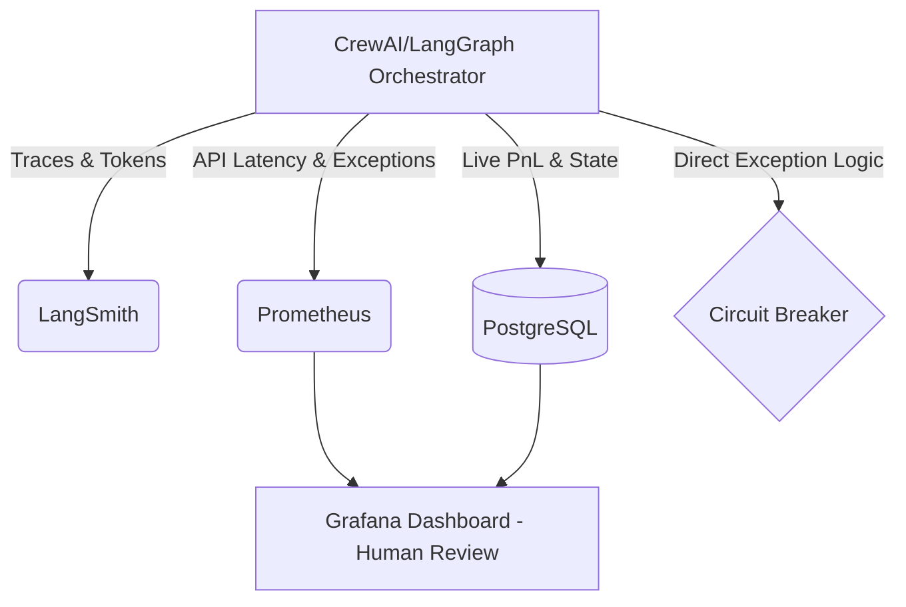

# Implementation Guide: Observability and Tracing

## 1. Node-Level Tracing and Telemetry Stack

Visibility into agent reasoning is paramount. The system must natively trace every tool call and LLM reasoning step.
* **LangSmith Integration:** Every LangGraph node and CrewAI task execution is wrapped in LangSmith context to log prompts, completions, and intermediate chain-of-thought traces.
* **Semantic Auditing:** We deploy an asynchronous `Semantic_Audit_Worker` that randomly samples 5% of Judge Agent outputs and verifies them against a strict rule-based logic framework.

### Telemetry Stack Diagram


## 2. Direct Application-Level Circuit Breakers

A $100 account cannot afford the latency of external observability tools triggering protective halts.
* **Internal Failsafe:** Circuit breakers are strictly coded in the core Python execution loop using `try/except` blocks. If `exceptions > 3 in 60s`, the system issues a **Halt and Catch Fire (HCF)** command.
* **HCF Protocol:** Cancels all open orders, liquidates open positions (or sets tight trailing stops if liquidity is poor), and sends a PagerDuty/SMS alert to the human operator. There is NO auto-healing with real capital.

## 3. Mathematical Guardrails Against Hallucinations

LLMs can cleverly bypass simple deterministic bounds. A sophisticated math-based sanity checker is placed between the Judge Agent and Alpaca execution.
* **Context-Aware Bound Checking:**
  ```python
  def sanity_check_order(proposed_price: float, current_price: float, atr_14: float) -> bool:
      # Block LLMs from bypassing with infinite target prices
      upper_bound = current_price + (3 * atr_14)
      if proposed_price > upper_bound:
          raise ValueError("HCF: Absurd Take-Profit target detected. Halting.")
      return True
  ```

## 4. Token Cost Dashboards & Net PnL Deduction

For micro-capital, API costs are a direct operational liability.
* **Token Cost Injection:** The `CostTracker` tool calculates the exact cost of the API requests (`prompt_tokens * price + completion_tokens * price`).
* **Real Net PnL:** The Portfolio Manager Agent subtracts this daily API cost from the gross trading profits. It only acts upon *Net PnL*, forcing the Meta-Review crew to optimize for token efficiency.

## 5. Reasoning Traceability and Shadow Portfolios

* **The Journaling Agent:** Translates LangSmith JSON traces into human-readable "Trade Rationale" Markdown files summarizing the debate that led to execution.
* **PnL Attribution via Shadow Portfolios:** You cannot properly attribute alpha via a unified Live account due to confounding variables.
  - **Live Portfolio:** Executes the consensus trade.
  - **Shadow Portfolio (Paper):** The system spins up parallel paper-trading records executing the dissenting opinions of minority agents.
  - After 100 trades, the Orchestrator analyzes the statistical divergence between the Live and Shadow portfolios to grant "Alpha Points" safely, ensuring agents that promote strict risk-management are never penalized for averting trades.
