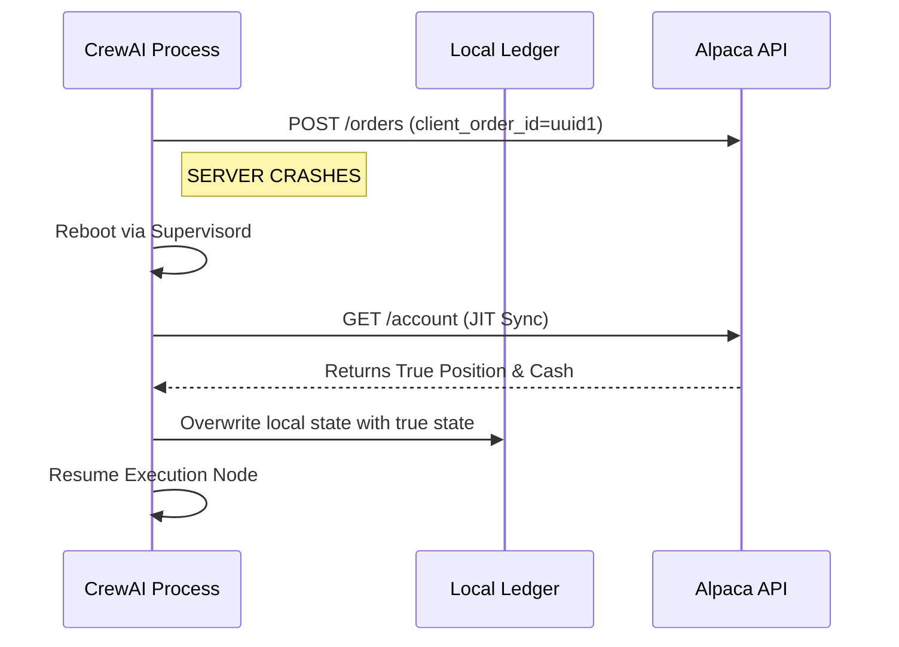

# Implementation Guide: State Recovery and Checkpointing

## 1. Automated Process Management and Re-entry Barriers

Python processes executing trades will inevitably crash. We manage this at the container level but strictly restrict infinite restart loops to protect capital.
* **Process Manager:** `Supervisord` or `systemd` runs the CrewAI process.
* **Re-entry Barrier:** `startretries=3`. If the system crashes 3 times within a 60-second window, it enters a `FATAL` state to prevent poison-pill executions from liquidating the account.

## 2. Idempotent Execution and Client Order IDs

The system must absolutely never double-execute an order due to a network timeout or crash.
* **Client Order IDs:** The Manager Agent generates a deterministic UUID (e.g., `buy_AAPL_20261026_1430`) for every trade intent.
* **Idempotency Check:** The `AlpacaOrderSubmissionTool` passes this UUID to Alpaca. If the crash occurred *after* Alpaca received the original order, Alpaca's API will reject the duplicate UUID upon reboot.

### Flow Diagram: Crash Reconciliation


## 3. Just-In-Time (JIT) Ledger Validation

End-of-day ledger syncing is insufficient for a micro-capital account where a -$0.05 drift causes API rejection.
* **Continuous Synchronization:** Before the `ExecutionNode` fires *any* order, it performs a lightweight JIT validation.
  ```python
  def execute_trade(intent: TradeIntent):
      alpaca_state = alpaca_api.get_account()
      if abs(alpaca_state.cash - local_sqlite.cash) > 0.01:
          local_sqlite.update_cash(alpaca_state.cash)
          intent.recalculate_size(alpaca_state.cash)
      alpaca_api.submit_order(intent)
  ```
* **Anomaly Halting:** If the ledger drift exceeds 1% of total equity, the system throws a critical exception and halts all trading.

## 4. LangGraph Persistent Checkpointing

Using LangGraph's native threading capabilities allows the Debate Workflow to resume exactly where it died.
* **Checkpoint Saver:** Using `SqliteSaver` or `PostgresSaver`.
* **State Resumption:** On boot, the system queries the Thread ID. If a graph was interrupted at the `JudgeAgent` node, LangGraph re-loads the state history from SQLite and skips the `FundamentalAgent` and `TechnicalAgent` steps entirely.

## 5. Atomic Transactional Boundaries

Separate legs of a trade (Entry, Stop Loss, Take Profit) must be submitted atomically.
* **Bracket Orders Only:** The Judge Agent is strictly banned from submitting standard market orders. It may only use the `BracketOrderSubmissionTool`.
* **Broker-Level Guarantee:** By using Alpaca's native bracket API, the stop-loss is mathematically attached to the entry order on Alpaca's servers, eliminating the risk of a crash leaving an open position unhedged.
