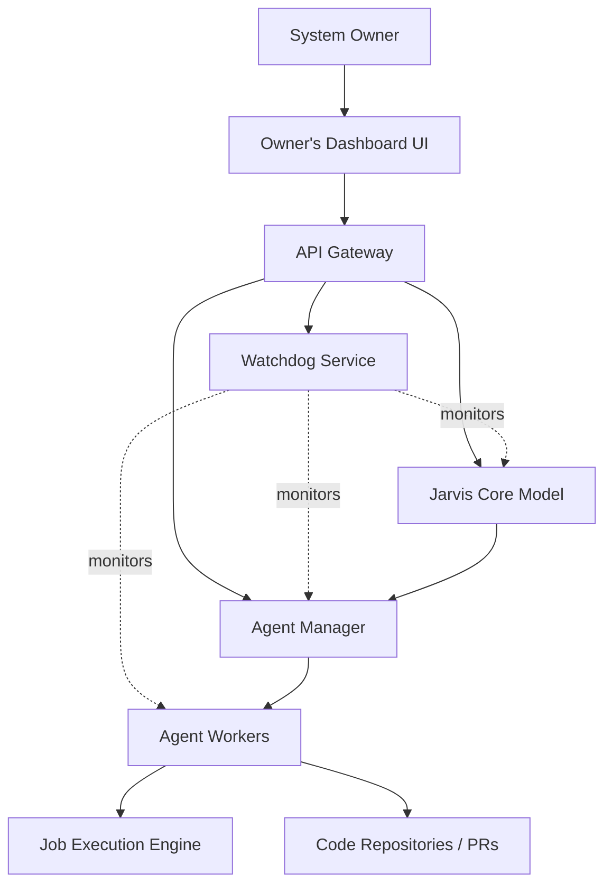

# Architecture 10,000-Foot View

From a high level, the architecture resembles a central brain commanding a swarm of specialized workers, all observed and managed by the owner through a unified dashboard.

## High-Level Topology

## Description
- **System Owner**: Interacts exclusively with the Owner's Dashboard.
- **Dashboard UI**: A highly interactive, holistic view of the system state, connecting to backend services via an API Gateway.
- **Watchdog Service**: Continuously polls and streams telemetry data back to the dashboard.
- **Jarvis Core Model**: Analyzes system performance and triggers self-evolution or spawns new agents.
- **Agent Manager**: Translates Jarvis's intent into running agent instances.
- **Agent Workers**: Execute specific tasks (e.g., uploading PRs, running tests).
